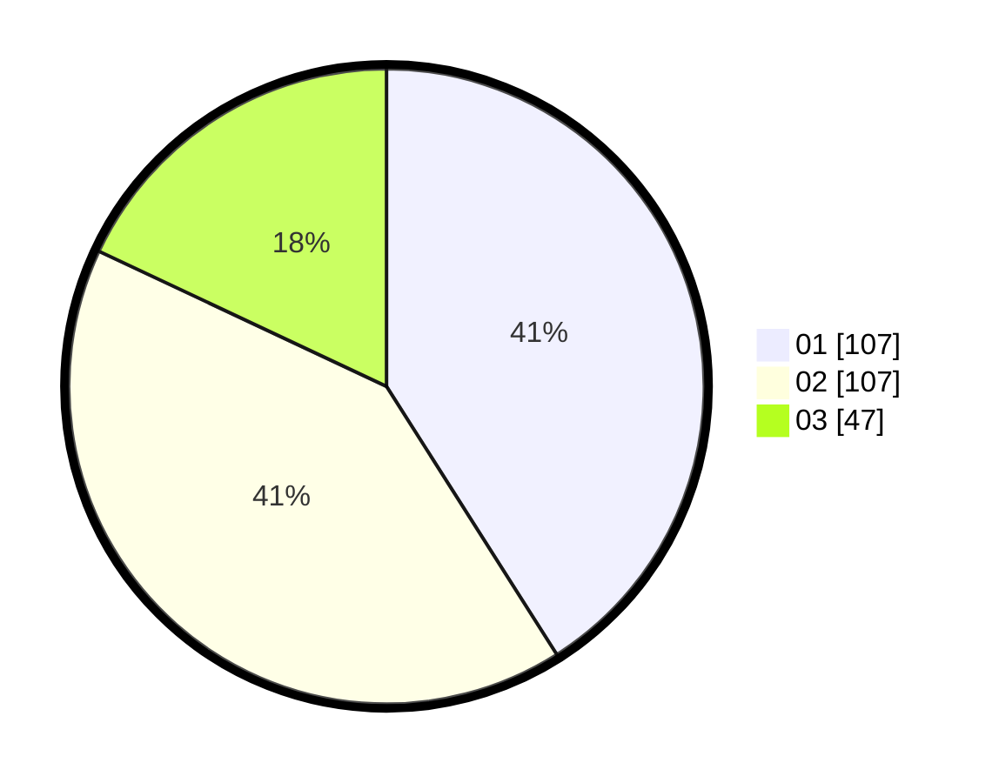

# Hasil

Hasil perolehan suara paslon dapat dilihat pada file paslon-01.txt, paslon-02.txt, dan paslon-03.txt.

Jika tidak ada, artinya data tersebut belum ada pada SIREKAP.

## Perolehan Suara

 * Paslon 01: **107**.
 * Paslon 02: **107**.
 * Paslon 03: **47**.

## Foto C Plano

https://sirekap-obj-formc.kpu.go.id/488e/pemilu/ppwp/31/01/01/10/02/3101011002001-20240217-225150--774d19ce-9c69-44c0-bd80-8ad0a12d0879.jpg

https://sirekap-obj-formc.kpu.go.id/488e/pemilu/ppwp/31/01/01/10/02/3101011002001-20240217-225151--554f3049-803a-4a7e-9e90-b268ddb32c7f.jpg

https://sirekap-obj-formc.kpu.go.id/488e/pemilu/ppwp/31/01/01/10/02/3101011002001-20240217-225151--675f08b3-2a65-4a2f-b423-e661295e5096.jpg

## DATA PEMILIH TETAP

Jumlah pemilih dalam DPT: **295**.
 * L: **146**.
 * P: **149**.

## DATA PENGGUNA HAK PILIH

Jumlah pengguna hak pilih dalam DPT: **250**.
 * L: **120**.
 * P: **130**.

Jumlah pengguna hak pilih dalam DPTb: **13**.
 * L: **13**.
 * P: **0**.

Jumlah pengguna hak pilih dalam DPK: **2**.
 * L: **2**.
 * P: **0**.

Jumlah pengguna hak pilih: **265**.
 * L: **135**.
 * P: **130**.

## JUMLAH SUARA SAH DAN TIDAK SAH

JUMLAH SELURUH SUARA SAH: **261**.

JUMLAH SUARA TIDAK SAH: **4**.

JUMLAH SELURUH SUARA SAH DAN SUARA TIDAK SAH: **265**.
