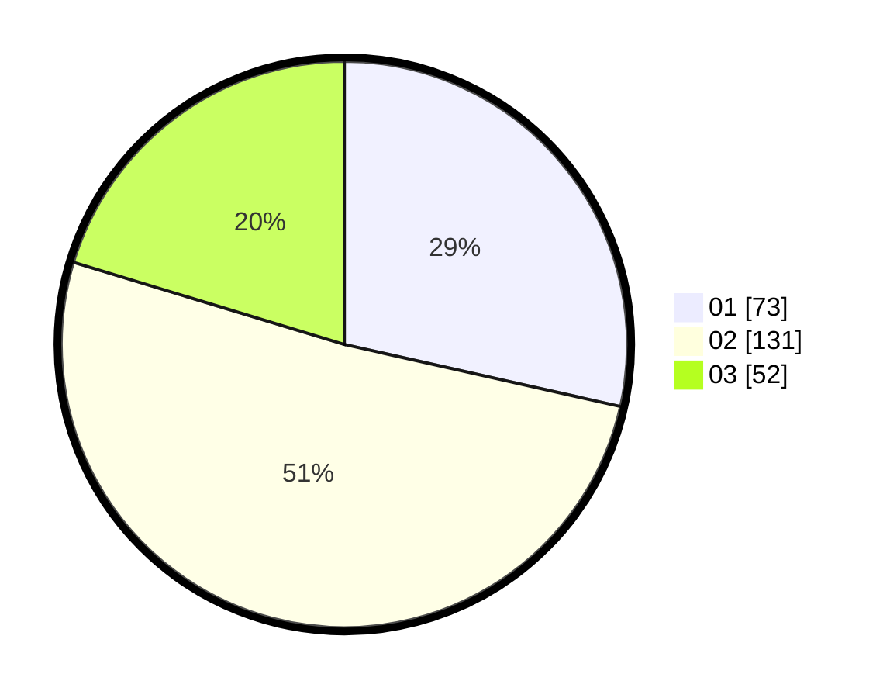

# Hasil

Hasil perolehan suara paslon dapat dilihat pada file paslon-01.txt, paslon-02.txt, dan paslon-03.txt.

Jika tidak ada, artinya data tersebut belum ada pada SIREKAP.

## Perolehan Suara

 * Paslon 01: **73**.
 * Paslon 02: **131**.
 * Paslon 03: **52**.

## Foto C Plano

https://sirekap-obj-formc.kpu.go.id/1f9c/pemilu/ppwp/31/01/01/10/02/3101011002002-20240214-232018--232c83b6-d2d3-4dbe-ad6e-088d8cccae3e.jpg

https://sirekap-obj-formc.kpu.go.id/1f9c/pemilu/ppwp/31/01/01/10/02/3101011002002-20240214-232205--452123a5-0d20-49f7-989c-accdd70f0c06.jpg

https://sirekap-obj-formc.kpu.go.id/1f9c/pemilu/ppwp/31/01/01/10/02/3101011002002-20240214-232245--55710d2d-b0c6-4d4d-9a8a-a2761f710b38.jpg

## DATA PEMILIH TETAP

Jumlah pemilih dalam DPT: **285**.
 * L: **145**.
 * P: **140**.

## DATA PENGGUNA HAK PILIH

Jumlah pengguna hak pilih dalam DPT: **244**.
 * L: **126**.
 * P: **118**.

Jumlah pengguna hak pilih dalam DPTb: **13**.
 * L: **13**.
 * P: **0**.

Jumlah pengguna hak pilih dalam DPK: **5**.
 * L: **3**.
 * P: **2**.

Jumlah pengguna hak pilih: **262**.
 * L: **142**.
 * P: **120**.

## JUMLAH SUARA SAH DAN TIDAK SAH

JUMLAH SELURUH SUARA SAH: **256**.

JUMLAH SUARA TIDAK SAH: **6**.

JUMLAH SELURUH SUARA SAH DAN SUARA TIDAK SAH: **262**.
