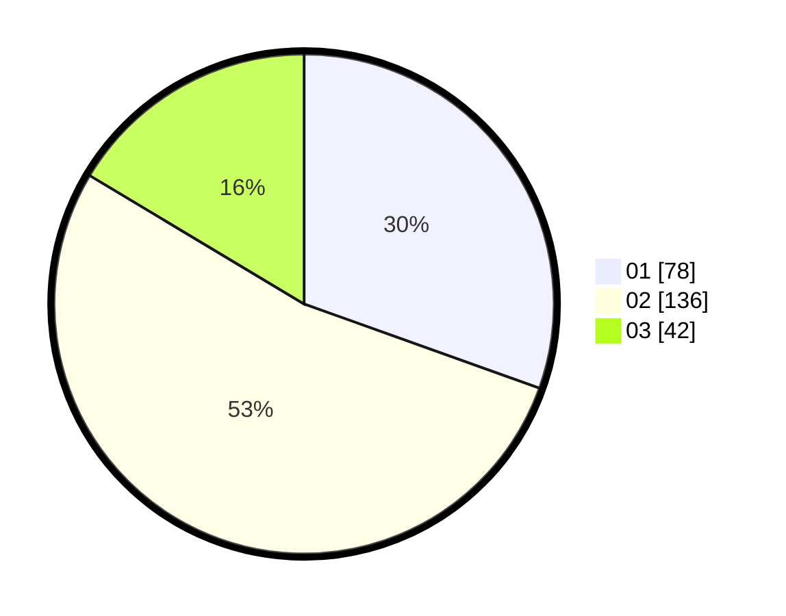

# Hasil

Hasil perolehan suara paslon dapat dilihat pada file paslon-01.txt, paslon-02.txt, dan paslon-03.txt.

Jika tidak ada, artinya data tersebut belum ada pada SIREKAP.

## Perolehan Suara

 * Paslon 01: **78**.
 * Paslon 02: **136**.
 * Paslon 03: **42**.

## Foto C Plano

https://sirekap-obj-formc.kpu.go.id/05db/pemilu/ppwp/31/01/01/10/02/3101011002003-20240218-110040--ea14c456-7674-4a40-afc0-7606e792dda3.jpg

https://sirekap-obj-formc.kpu.go.id/05db/pemilu/ppwp/31/01/01/10/02/3101011002003-20240218-110042--cebed885-2fe6-407a-9e73-e56b04f52b73.jpg

https://sirekap-obj-formc.kpu.go.id/05db/pemilu/ppwp/31/01/01/10/02/3101011002003-20240218-110041--d721974c-6ebc-4c54-96c0-7668e333e9d3.jpg

## DATA PEMILIH TETAP

Jumlah pemilih dalam DPT: **286**.
 * L: **143**.
 * P: **143**.

## DATA PENGGUNA HAK PILIH

Jumlah pengguna hak pilih dalam DPT: **252**.
 * L: **122**.
 * P: **130**.

Jumlah pengguna hak pilih dalam DPTb: **7**.
 * L: **7**.
 * P: **0**.

Jumlah pengguna hak pilih dalam DPK: **1**.
 * L: **1**.
 * P: **0**.

Jumlah pengguna hak pilih: **260**.
 * L: **130**.
 * P: **130**.

## JUMLAH SUARA SAH DAN TIDAK SAH

JUMLAH SELURUH SUARA SAH: **256**.

JUMLAH SUARA TIDAK SAH: **4**.

JUMLAH SELURUH SUARA SAH DAN SUARA TIDAK SAH: **260**.
