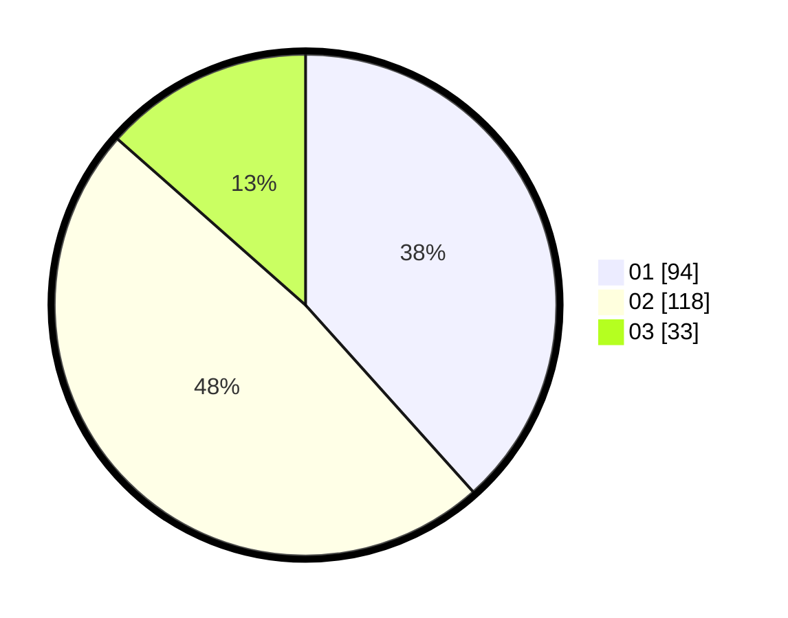

# Hasil

Hasil perolehan suara paslon dapat dilihat pada file paslon-01.txt, paslon-02.txt, dan paslon-03.txt.

Jika tidak ada, artinya data tersebut belum ada pada SIREKAP.

## Perolehan Suara

 * Paslon 01: **94**.
 * Paslon 02: **118**.
 * Paslon 03: **33**.

## Foto C Plano

https://sirekap-obj-formc.kpu.go.id/c717/pemilu/ppwp/31/01/01/10/02/3101011002004-20240219-100627--70111dc1-b263-4e9b-ab13-620ebc80d543.jpg

https://sirekap-obj-formc.kpu.go.id/c717/pemilu/ppwp/31/01/01/10/02/3101011002004-20240219-100712--bcd060be-8d39-4122-bd14-562f88b736e2.jpg

https://sirekap-obj-formc.kpu.go.id/c717/pemilu/ppwp/31/01/01/10/02/3101011002004-20240219-100746--1a70bf18-d047-4b55-a572-39426a011d0c.jpg

## DATA PEMILIH TETAP

Jumlah pemilih dalam DPT: **292**.
 * L: **144**.
 * P: **148**.

## DATA PENGGUNA HAK PILIH

Jumlah pengguna hak pilih dalam DPT: **244**.
 * L: **116**.
 * P: **128**.

Jumlah pengguna hak pilih dalam DPTb: **5**.
 * L: **5**.
 * P: **0**.

Jumlah pengguna hak pilih dalam DPK: **0**.
 * L: **0**.
 * P: **0**.

Jumlah pengguna hak pilih: **249**.
 * L: **121**.
 * P: **128**.

## JUMLAH SUARA SAH DAN TIDAK SAH

JUMLAH SELURUH SUARA SAH: **245**.

JUMLAH SUARA TIDAK SAH: **4**.

JUMLAH SELURUH SUARA SAH DAN SUARA TIDAK SAH: **249**.
