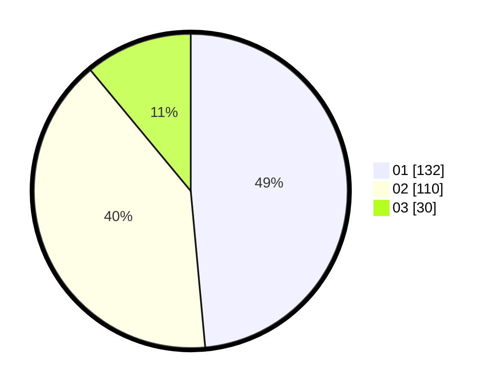

# Hasil

Hasil perolehan suara paslon dapat dilihat pada file paslon-01.txt, paslon-02.txt, dan paslon-03.txt.

Jika tidak ada, artinya data tersebut belum ada pada SIREKAP.

## Perolehan Suara

 * Paslon 01: **132**.
 * Paslon 02: **110**.
 * Paslon 03: **30**.

## Foto C Plano

https://sirekap-obj-formc.kpu.go.id/df21/pemilu/ppwp/31/01/01/10/02/3101011002005-20240218-111123--51e017b0-0a87-45cb-8c0a-13a6f0487eed.jpg

https://sirekap-obj-formc.kpu.go.id/df21/pemilu/ppwp/31/01/01/10/02/3101011002005-20240218-111125--f3ce3f71-1822-48f6-829b-e82bcdd3ef56.jpg

https://sirekap-obj-formc.kpu.go.id/df21/pemilu/ppwp/31/01/01/10/02/3101011002005-20240218-111124--9715537b-7d6f-4dc6-b1a0-4a887e11b7c8.jpg

## DATA PEMILIH TETAP

Jumlah pemilih dalam DPT: **289**.
 * L: **147**.
 * P: **142**.

## DATA PENGGUNA HAK PILIH

Jumlah pengguna hak pilih dalam DPT: **242**.
 * L: **115**.
 * P: **127**.

Jumlah pengguna hak pilih dalam DPTb: **32**.
 * L: **31**.
 * P: **1**.

Jumlah pengguna hak pilih dalam DPK: **1**.
 * L: **0**.
 * P: **1**.

Jumlah pengguna hak pilih: **275**.
 * L: **146**.
 * P: **129**.

## JUMLAH SUARA SAH DAN TIDAK SAH

JUMLAH SELURUH SUARA SAH: **272**.

JUMLAH SUARA TIDAK SAH: **3**.

JUMLAH SELURUH SUARA SAH DAN SUARA TIDAK SAH: **275**.
