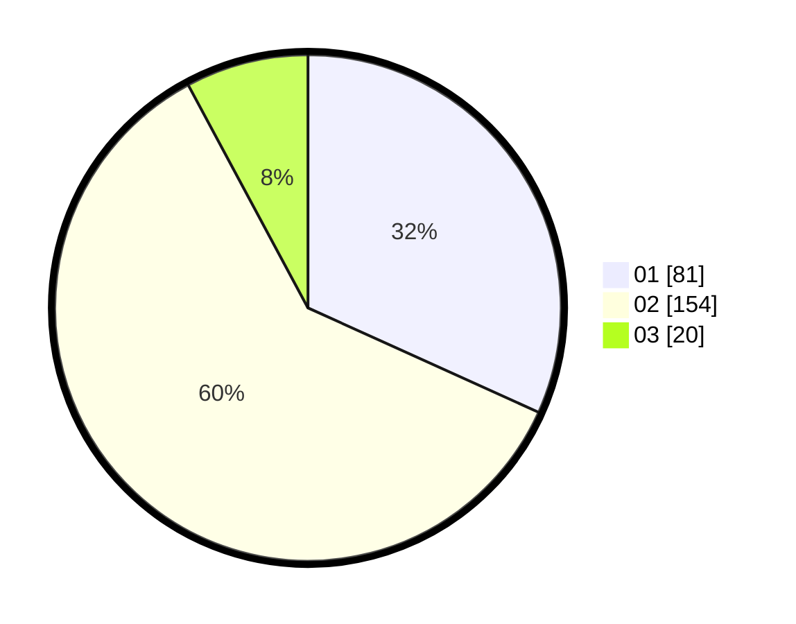

# Hasil

Hasil perolehan suara paslon dapat dilihat pada file paslon-01.txt, paslon-02.txt, dan paslon-03.txt.

Jika tidak ada, artinya data tersebut belum ada pada SIREKAP.

## Perolehan Suara

 * Paslon 01: **81**.
 * Paslon 02: **154**.
 * Paslon 03: **20**.

## Foto C Plano

https://sirekap-obj-formc.kpu.go.id/1c86/pemilu/ppwp/31/01/01/10/02/3101011002007-20240217-164224--b28e5e4e-8371-48e7-b983-5e6f6e89439f.jpg

https://sirekap-obj-formc.kpu.go.id/1c86/pemilu/ppwp/31/01/01/10/02/3101011002007-20240217-164225--177a0b50-06fb-4782-9edd-a2c038c46487.jpg

https://sirekap-obj-formc.kpu.go.id/1c86/pemilu/ppwp/31/01/01/10/02/3101011002007-20240217-164224--c63a871b-8265-4dac-8cd0-a36bec3ffa47.jpg

## DATA PEMILIH TETAP

Jumlah pemilih dalam DPT: **287**.
 * L: **144**.
 * P: **143**.

## DATA PENGGUNA HAK PILIH

Jumlah pengguna hak pilih dalam DPT: **245**.
 * L: **126**.
 * P: **119**.

Jumlah pengguna hak pilih dalam DPTb: **14**.
 * L: **14**.
 * P: **0**.

Jumlah pengguna hak pilih dalam DPK: **0**.
 * L: **0**.
 * P: **0**.

Jumlah pengguna hak pilih: **259**.
 * L: **140**.
 * P: **119**.

## JUMLAH SUARA SAH DAN TIDAK SAH

JUMLAH SELURUH SUARA SAH: **255**.

JUMLAH SUARA TIDAK SAH: **4**.

JUMLAH SELURUH SUARA SAH DAN SUARA TIDAK SAH: **259**.
