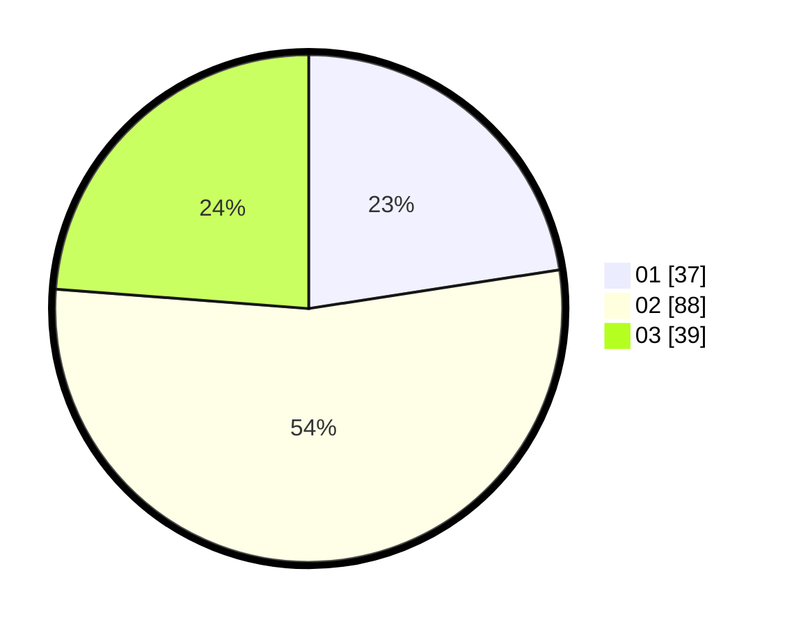

# Hasil

Hasil perolehan suara paslon dapat dilihat pada file paslon-01.txt, paslon-02.txt, dan paslon-03.txt.

Jika tidak ada, artinya data tersebut belum ada pada SIREKAP.

## Perolehan Suara

 * Paslon 01: **37**.
 * Paslon 02: **88**.
 * Paslon 03: **39**.

## Foto C Plano

https://sirekap-obj-formc.kpu.go.id/543f/pemilu/ppwp/31/01/01/10/02/3101011002018-20240218-111130--41e56cf5-50cc-456a-ae9c-a2b0f9711e66.jpg

https://sirekap-obj-formc.kpu.go.id/543f/pemilu/ppwp/31/01/01/10/02/3101011002018-20240218-112440--4b9f3f3b-2ecf-474f-9b7f-ba804d4d3b64.jpg

https://sirekap-obj-formc.kpu.go.id/543f/pemilu/ppwp/31/01/01/10/02/3101011002018-20240218-110450--66bd4f08-8b31-4f55-bd2f-2ff546e558bd.jpg
