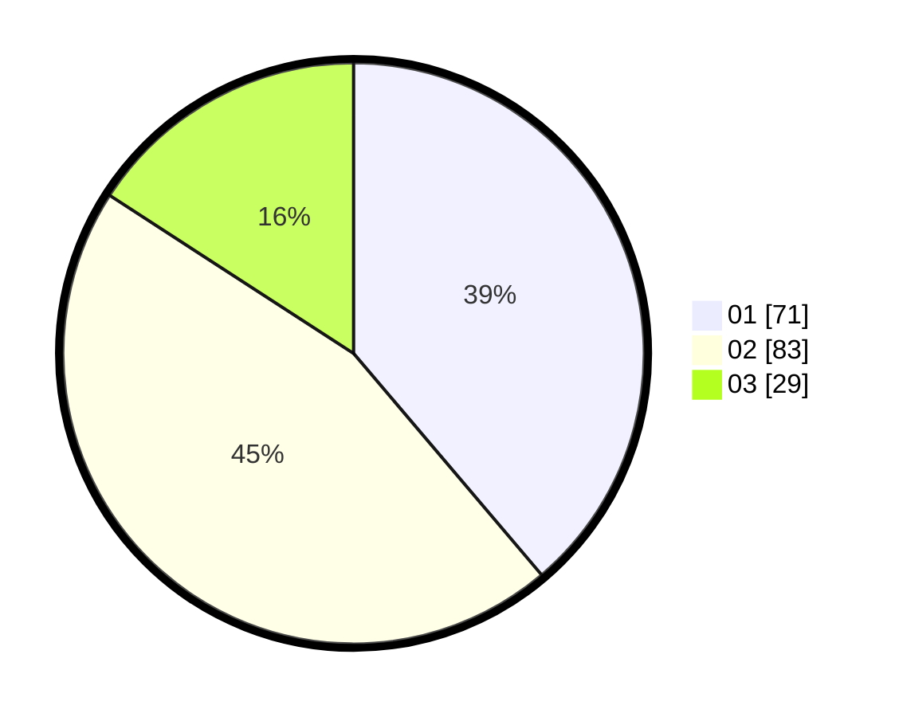

# Hasil

Hasil perolehan suara paslon dapat dilihat pada file paslon-01.txt, paslon-02.txt, dan paslon-03.txt.

Jika tidak ada, artinya data tersebut belum ada pada SIREKAP.

## Perolehan Suara

 * Paslon 01: **71**.
 * Paslon 02: **83**.
 * Paslon 03: **29**.

## Foto C Plano

https://sirekap-obj-formc.kpu.go.id/d2b1/pemilu/ppwp/31/01/01/10/02/3101011002902-20240214-185623--48f28286-15c2-4c97-84f7-40bc2d26f0d3.jpg

https://sirekap-obj-formc.kpu.go.id/d2b1/pemilu/ppwp/31/01/01/10/02/3101011002902-20240214-185303--2278b922-d1d0-4ecd-a00c-2d1d5c4598d8.jpg

https://sirekap-obj-formc.kpu.go.id/d2b1/pemilu/ppwp/31/01/01/10/02/3101011002902-20240214-185731--163d7fe0-aba5-4277-99a7-134cb5b83711.jpg

## DATA PEMILIH TETAP

Jumlah pemilih dalam DPT: **258**.
 * L: **258**.
 * P: **0**.

## DATA PENGGUNA HAK PILIH

Jumlah pengguna hak pilih dalam DPT: **175**.
 * L: **175**.
 * P: **0**.

Jumlah pengguna hak pilih dalam DPTb: **14**.
 * L: **14**.
 * P: **0**.

Jumlah pengguna hak pilih dalam DPK: **0**.
 * L: **0**.
 * P: **0**.

Jumlah pengguna hak pilih: **189**.
 * L: **189**.
 * P: **0**.

## JUMLAH SUARA SAH DAN TIDAK SAH

JUMLAH SELURUH SUARA SAH: **183**.

JUMLAH SUARA TIDAK SAH: **6**.

JUMLAH SELURUH SUARA SAH DAN SUARA TIDAK SAH: **189**.
