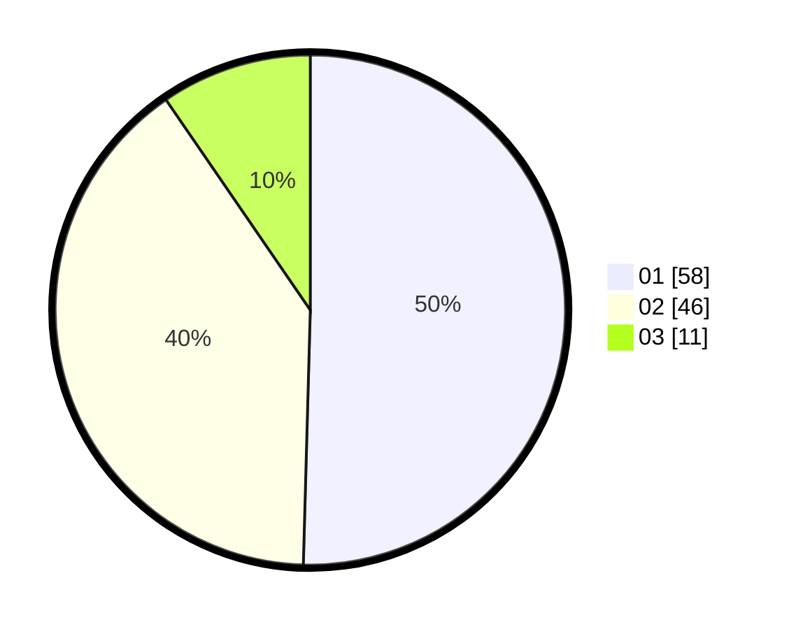

# Hasil

Hasil perolehan suara paslon dapat dilihat pada file paslon-01.txt, paslon-02.txt, dan paslon-03.txt.

Jika tidak ada, artinya data tersebut belum ada pada SIREKAP.

## Perolehan Suara

 * Paslon 01: **58**.
 * Paslon 02: **46**.
 * Paslon 03: **11**.

## Foto C Plano

https://sirekap-obj-formc.kpu.go.id/b02e/pemilu/ppwp/31/01/01/10/02/3101011002903-20240215-053511--aa76e1ef-9f57-4d47-b831-25d14a7af8c5.jpg

https://sirekap-obj-formc.kpu.go.id/b02e/pemilu/ppwp/31/01/01/10/02/3101011002903-20240215-053623--2faf5a48-1d59-4ad6-a944-9d4ecc6594da.jpg

https://sirekap-obj-formc.kpu.go.id/b02e/pemilu/ppwp/31/01/01/10/02/3101011002903-20240215-054109--e0b29be0-a35c-4838-90d2-30a2dd188827.jpg
