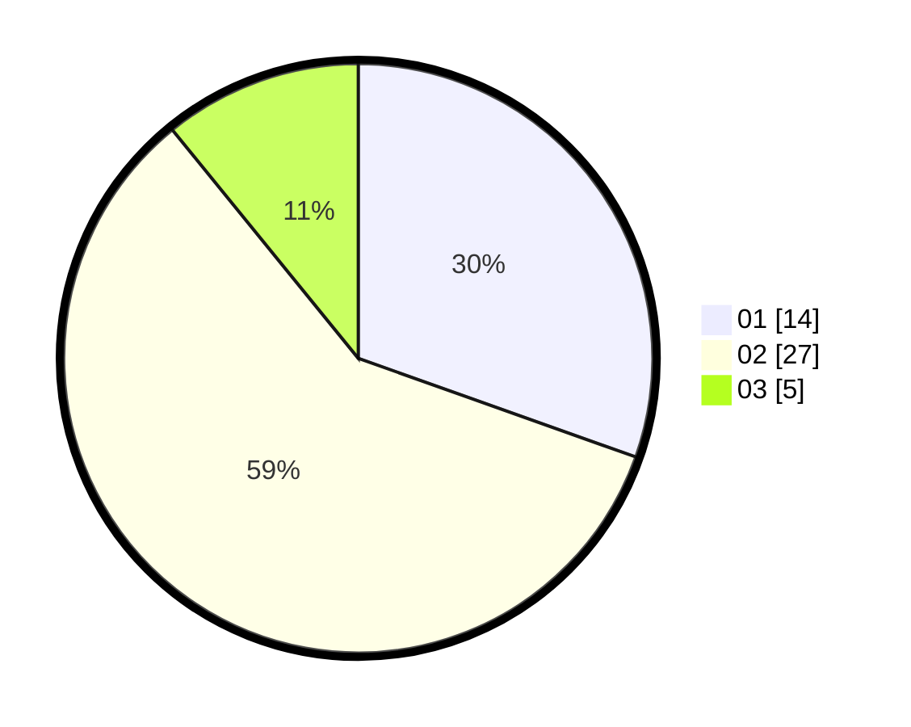

# Hasil

Hasil perolehan suara paslon dapat dilihat pada file paslon-01.txt, paslon-02.txt, dan paslon-03.txt.

Jika tidak ada, artinya data tersebut belum ada pada SIREKAP.

## Perolehan Suara

 * Paslon 01: **14**.
 * Paslon 02: **27**.
 * Paslon 03: **5**.

## Foto C Plano

https://sirekap-obj-formc.kpu.go.id/3c67/pemilu/ppwp/31/01/01/10/02/3101011002904-20240215-061044--2e64e629-a70a-4bd5-856a-4671366a2e8f.jpg

https://sirekap-obj-formc.kpu.go.id/3c67/pemilu/ppwp/31/01/01/10/02/3101011002904-20240215-010432--22459daf-4fe4-46af-a027-de3335777696.jpg

https://sirekap-obj-formc.kpu.go.id/3c67/pemilu/ppwp/31/01/01/10/02/3101011002904-20240216-015934--0f9f83f1-32b6-4c98-9eab-e5ae2ff34991.jpg

## DATA PEMILIH TETAP

Jumlah pemilih dalam DPT: **50**.
 * L: **50**.
 * P: **0**.

## DATA PENGGUNA HAK PILIH

Jumlah pengguna hak pilih dalam DPT: **42**.
 * L: **42**.
 * P: **0**.

Jumlah pengguna hak pilih dalam DPTb: **4**.
 * L: **4**.
 * P: **0**.

Jumlah pengguna hak pilih dalam DPK: **0**.
 * L: **0**.
 * P: **0**.

Jumlah pengguna hak pilih: **46**.
 * L: **46**.
 * P: **0**.

## JUMLAH SUARA SAH DAN TIDAK SAH

JUMLAH SELURUH SUARA SAH: **46**.

JUMLAH SUARA TIDAK SAH: **0**.

JUMLAH SELURUH SUARA SAH DAN SUARA TIDAK SAH: **46**.
