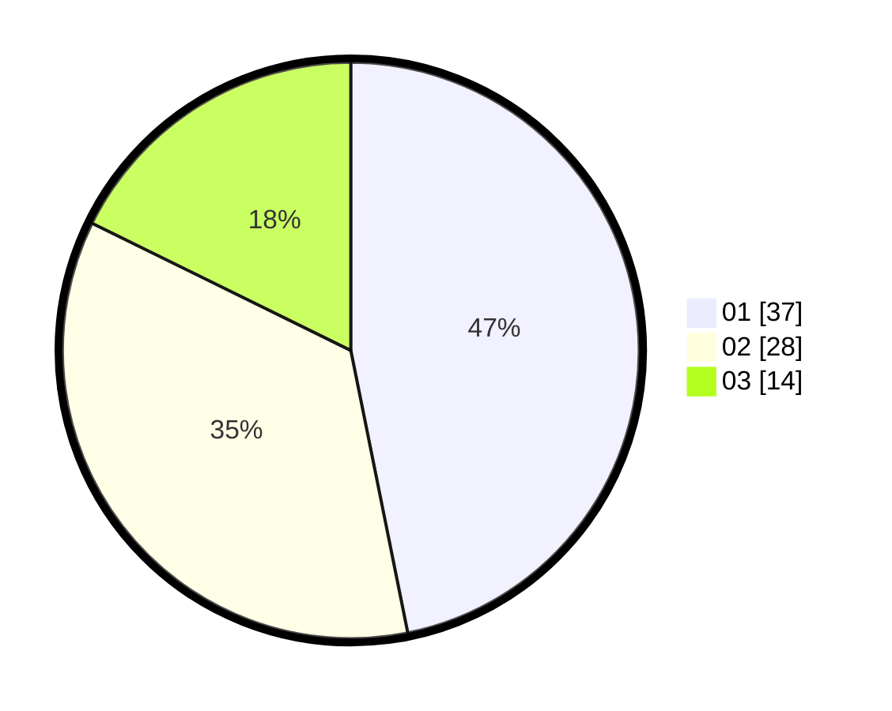

# Hasil

Hasil perolehan suara paslon dapat dilihat pada file paslon-01.txt, paslon-02.txt, dan paslon-03.txt.

Jika tidak ada, artinya data tersebut belum ada pada SIREKAP.

## Perolehan Suara

 * Paslon 01: **37**.
 * Paslon 02: **28**.
 * Paslon 03: **14**.

## Foto C Plano

https://sirekap-obj-formc.kpu.go.id/1d68/pemilu/ppwp/31/01/01/10/02/3101011002905-20240215-034055--0d35a249-a62c-4b00-99e4-668950ca8823.jpg

https://sirekap-obj-formc.kpu.go.id/1d68/pemilu/ppwp/31/01/01/10/02/3101011002905-20240215-034444--a4b144b5-2c83-4775-a9fe-c4e9aaf3ab42.jpg

https://sirekap-obj-formc.kpu.go.id/1d68/pemilu/ppwp/31/01/01/10/02/3101011002905-20240215-034511--dd276230-cd92-4815-af6a-5ba5edb7d5d4.jpg

## DATA PEMILIH TETAP

Jumlah pemilih dalam DPT: **88**.
 * L: **88**.
 * P: **0**.

## DATA PENGGUNA HAK PILIH

Jumlah pengguna hak pilih dalam DPT: **57**.
 * L: **57**.
 * P: **0**.

Jumlah pengguna hak pilih dalam DPTb: **23**.
 * L: **23**.
 * P: **0**.

Jumlah pengguna hak pilih dalam DPK: **0**.
 * L: **0**.
 * P: **0**.

Jumlah pengguna hak pilih: **80**.
 * L: **80**.
 * P: **0**.

## JUMLAH SUARA SAH DAN TIDAK SAH

JUMLAH SELURUH SUARA SAH: **79**.

JUMLAH SUARA TIDAK SAH: **1**.

JUMLAH SELURUH SUARA SAH DAN SUARA TIDAK SAH: **80**.
