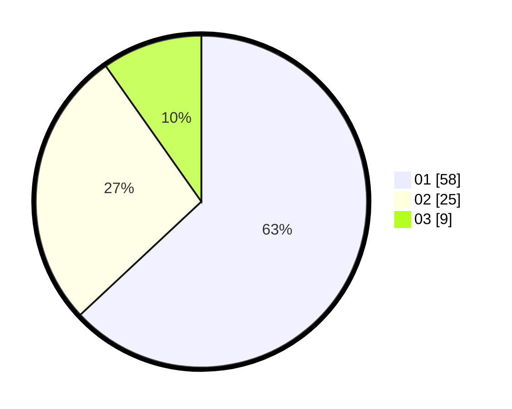

# Hasil

Hasil perolehan suara paslon dapat dilihat pada file paslon-01.txt, paslon-02.txt, dan paslon-03.txt.

Jika tidak ada, artinya data tersebut belum ada pada SIREKAP.

## Perolehan Suara

 * Paslon 01: **58**.
 * Paslon 02: **25**.
 * Paslon 03: **9**.

## Foto C Plano

https://sirekap-obj-formc.kpu.go.id/1a8c/pemilu/ppwp/31/01/01/10/02/3101011002906-20240215-070846--2f283727-e1e8-4040-a5c4-f8bdb97567ce.jpg

https://sirekap-obj-formc.kpu.go.id/1a8c/pemilu/ppwp/31/01/01/10/02/3101011002906-20240215-071048--9d420cc4-4ada-4774-85d5-344e1378378f.jpg

https://sirekap-obj-formc.kpu.go.id/1a8c/pemilu/ppwp/31/01/01/10/02/3101011002906-20240215-071150--7efe4aa3-7a5a-4941-b6c7-555649e6be54.jpg
