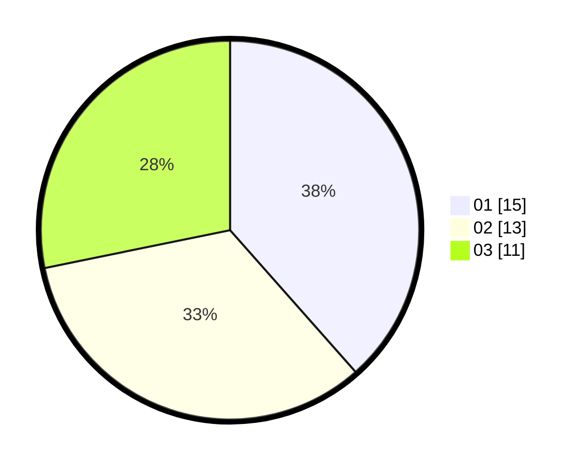

# Hasil

Hasil perolehan suara paslon dapat dilihat pada file paslon-01.txt, paslon-02.txt, dan paslon-03.txt.

Jika tidak ada, artinya data tersebut belum ada pada SIREKAP.

## Perolehan Suara

 * Paslon 01: **15**.
 * Paslon 02: **13**.
 * Paslon 03: **11**.

## Foto C Plano

https://sirekap-obj-formc.kpu.go.id/3c63/pemilu/ppwp/31/01/01/10/02/3101011002908-20240214-194858--bcd06b36-1581-465d-979b-005637d1a245.jpg

https://sirekap-obj-formc.kpu.go.id/3c63/pemilu/ppwp/31/01/01/10/02/3101011002908-20240214-194957--fe34bb3f-bf76-4541-9bb9-62ce982439e6.jpg

https://sirekap-obj-formc.kpu.go.id/3c63/pemilu/ppwp/31/01/01/10/02/3101011002908-20240214-194647--9522a55c-2de3-40fa-b5ed-91d63fdbcd6a.jpg
