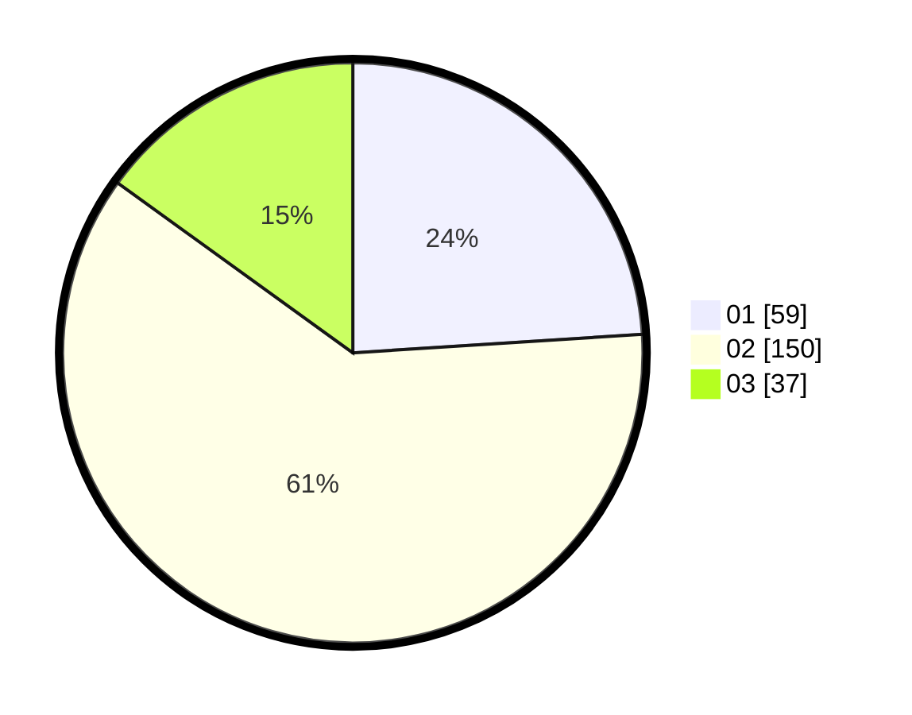

# Hasil

Hasil perolehan suara paslon dapat dilihat pada file paslon-01.txt, paslon-02.txt, dan paslon-03.txt.

Jika tidak ada, artinya data tersebut belum ada pada SIREKAP.

## Perolehan Suara

 * Paslon 01: **59**.
 * Paslon 02: **150**.
 * Paslon 03: **37**.

## Foto C Plano

https://sirekap-obj-formc.kpu.go.id/3eb0/pemilu/ppwp/31/01/01/10/03/3101011003001-20240216-144555--f66836db-e861-40cb-831e-e765d3de1f07.jpg

https://sirekap-obj-formc.kpu.go.id/3eb0/pemilu/ppwp/31/01/01/10/03/3101011003001-20240216-144556--32e2cf35-df20-4772-9f3d-ad2209787624.jpg

https://sirekap-obj-formc.kpu.go.id/3eb0/pemilu/ppwp/31/01/01/10/03/3101011003001-20240216-144555--0b1985d5-4daa-4668-a70d-baa557062a90.jpg

## DATA PEMILIH TETAP

Jumlah pemilih dalam DPT: **276**.
 * L: **142**.
 * P: **134**.

## DATA PENGGUNA HAK PILIH

Jumlah pengguna hak pilih dalam DPT: **241**.
 * L: **120**.
 * P: **121**.

Jumlah pengguna hak pilih dalam DPTb: **4**.
 * L: **1**.
 * P: **3**.

Jumlah pengguna hak pilih dalam DPK: **3**.
 * L: **1**.
 * P: **2**.

Jumlah pengguna hak pilih: **248**.
 * L: **122**.
 * P: **126**.

## JUMLAH SUARA SAH DAN TIDAK SAH

JUMLAH SELURUH SUARA SAH: **246**.

JUMLAH SUARA TIDAK SAH: **2**.

JUMLAH SELURUH SUARA SAH DAN SUARA TIDAK SAH: **248**.
