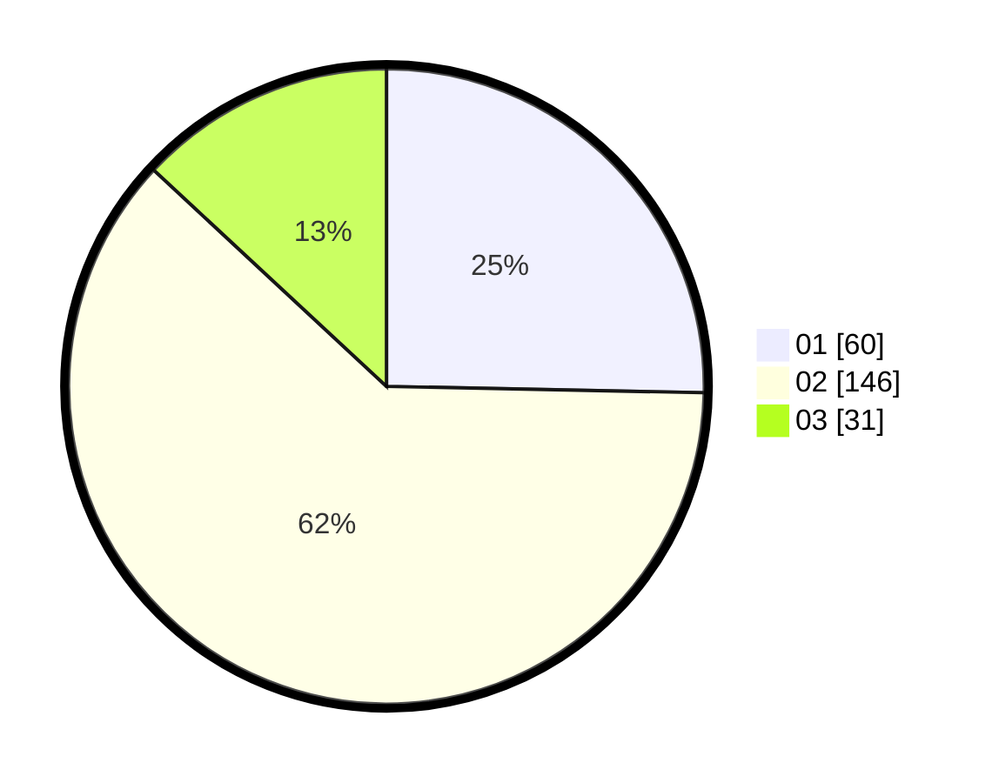

# Hasil

Hasil perolehan suara paslon dapat dilihat pada file paslon-01.txt, paslon-02.txt, dan paslon-03.txt.

Jika tidak ada, artinya data tersebut belum ada pada SIREKAP.

## Perolehan Suara

 * Paslon 01: **60**.
 * Paslon 02: **146**.
 * Paslon 03: **31**.

## Foto C Plano

https://sirekap-obj-formc.kpu.go.id/6690/pemilu/ppwp/31/01/01/10/03/3101011003002-20240215-033258--d4b5943c-b9ed-4c49-bbe6-07ab935ecabd.jpg

https://sirekap-obj-formc.kpu.go.id/6690/pemilu/ppwp/31/01/01/10/03/3101011003002-20240214-204651--30fbc990-ab6a-440f-ad7a-1524b9fc1114.jpg

https://sirekap-obj-formc.kpu.go.id/6690/pemilu/ppwp/31/01/01/10/03/3101011003002-20240214-204738--82f139c2-2adf-4aba-8b1a-63293ce91c3f.jpg

## DATA PEMILIH TETAP

Jumlah pemilih dalam DPT: **270**.
 * L: **138**.
 * P: **132**.

## DATA PENGGUNA HAK PILIH

Jumlah pengguna hak pilih dalam DPT: **236**.
 * L: **120**.
 * P: **116**.

Jumlah pengguna hak pilih dalam DPTb: **6**.
 * L: **3**.
 * P: **3**.

Jumlah pengguna hak pilih dalam DPK: **0**.
 * L: **0**.
 * P: **0**.

Jumlah pengguna hak pilih: **242**.
 * L: **123**.
 * P: **119**.

## JUMLAH SUARA SAH DAN TIDAK SAH

JUMLAH SELURUH SUARA SAH: **237**.

JUMLAH SUARA TIDAK SAH: **5**.

JUMLAH SELURUH SUARA SAH DAN SUARA TIDAK SAH: **242**.
