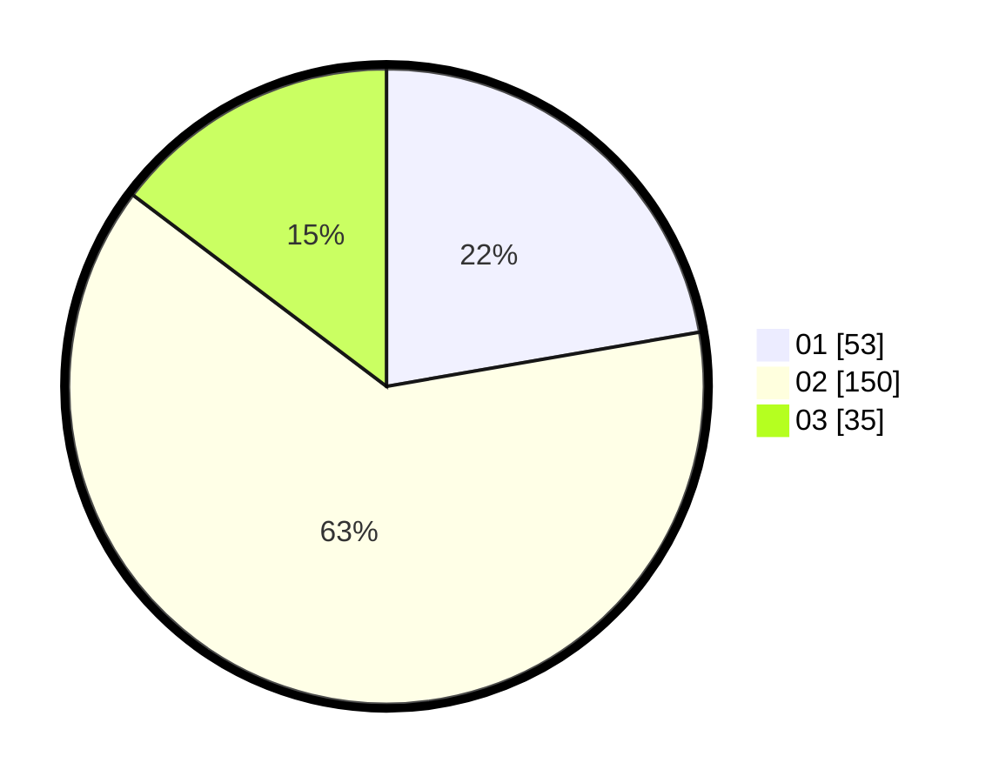

# Hasil

Hasil perolehan suara paslon dapat dilihat pada file paslon-01.txt, paslon-02.txt, dan paslon-03.txt.

Jika tidak ada, artinya data tersebut belum ada pada SIREKAP.

## Perolehan Suara

 * Paslon 01: **53**.
 * Paslon 02: **150**.
 * Paslon 03: **35**.

## Foto C Plano

https://sirekap-obj-formc.kpu.go.id/fd43/pemilu/ppwp/31/01/01/10/03/3101011003004-20240214-155051--7767201e-ca02-499b-8bb0-0345de8a10e2.jpg

https://sirekap-obj-formc.kpu.go.id/fd43/pemilu/ppwp/31/01/01/10/03/3101011003004-20240214-155047--93f31aa4-a73f-447d-bb3a-696a897c29b0.jpg

https://sirekap-obj-formc.kpu.go.id/fd43/pemilu/ppwp/31/01/01/10/03/3101011003004-20240214-155042--1fbc36ad-c72b-4f25-b1d1-0f0d12b9c6d6.jpg

## DATA PEMILIH TETAP

Jumlah pemilih dalam DPT: **279**.
 * L: **135**.
 * P: **144**.

## DATA PENGGUNA HAK PILIH

Jumlah pengguna hak pilih dalam DPT: **238**.
 * L: **110**.
 * P: **128**.

Jumlah pengguna hak pilih dalam DPTb: **3**.
 * L: **3**.
 * P: **0**.

Jumlah pengguna hak pilih dalam DPK: **0**.
 * L: **0**.
 * P: **0**.

Jumlah pengguna hak pilih: **241**.
 * L: **113**.
 * P: **128**.

## JUMLAH SUARA SAH DAN TIDAK SAH

JUMLAH SELURUH SUARA SAH: **238**.

JUMLAH SUARA TIDAK SAH: **3**.

JUMLAH SELURUH SUARA SAH DAN SUARA TIDAK SAH: **241**.
