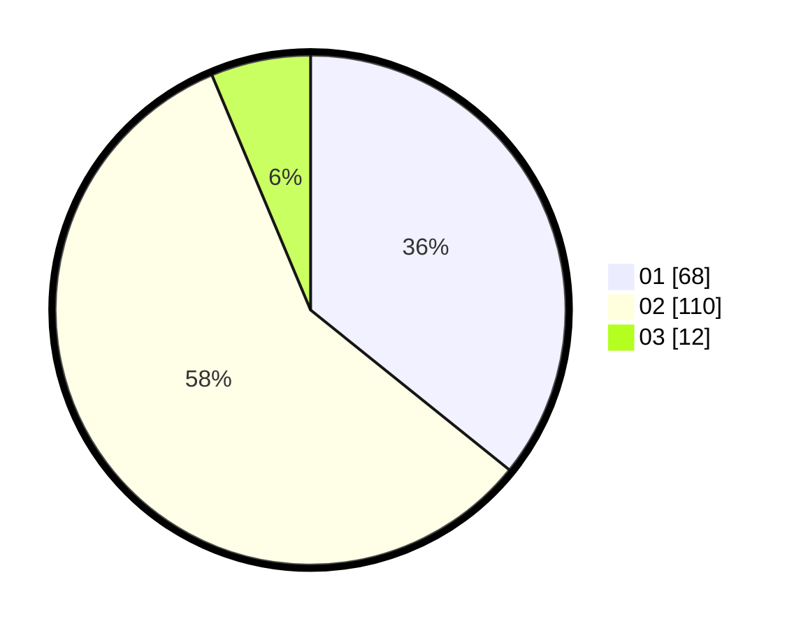

# Hasil

Hasil perolehan suara paslon dapat dilihat pada file paslon-01.txt, paslon-02.txt, dan paslon-03.txt.

Jika tidak ada, artinya data tersebut belum ada pada SIREKAP.

## Perolehan Suara

 * Paslon 01: **68**.
 * Paslon 02: **110**.
 * Paslon 03: **12**.

## Foto C Plano

https://sirekap-obj-formc.kpu.go.id/5b2e/pemilu/ppwp/31/01/01/10/03/3101011003005-20240216-143312--ff461dbc-ee1b-4286-a68f-be584f79ffd4.jpg

https://sirekap-obj-formc.kpu.go.id/5b2e/pemilu/ppwp/31/01/01/10/03/3101011003005-20240217-010421--201ea526-6df6-4100-8624-4875ee6731ec.jpg

https://sirekap-obj-formc.kpu.go.id/5b2e/pemilu/ppwp/31/01/01/10/03/3101011003005-20240217-010421--583502de-ec84-41d5-956c-b8f9b8ef0e14.jpg

## DATA PEMILIH TETAP

Jumlah pemilih dalam DPT: **218**.
 * L: **112**.
 * P: **106**.

## DATA PENGGUNA HAK PILIH

Jumlah pengguna hak pilih dalam DPT: **189**.
 * L: **91**.
 * P: **98**.

Jumlah pengguna hak pilih dalam DPTb: **3**.
 * L: **1**.
 * P: **2**.

Jumlah pengguna hak pilih dalam DPK: **8**.
 * L: **2**.
 * P: **6**.

Jumlah pengguna hak pilih: **200**.
 * L: **94**.
 * P: **106**.

## JUMLAH SUARA SAH DAN TIDAK SAH

JUMLAH SELURUH SUARA SAH: **190**.

JUMLAH SUARA TIDAK SAH: **10**.

JUMLAH SELURUH SUARA SAH DAN SUARA TIDAK SAH: **200**.
