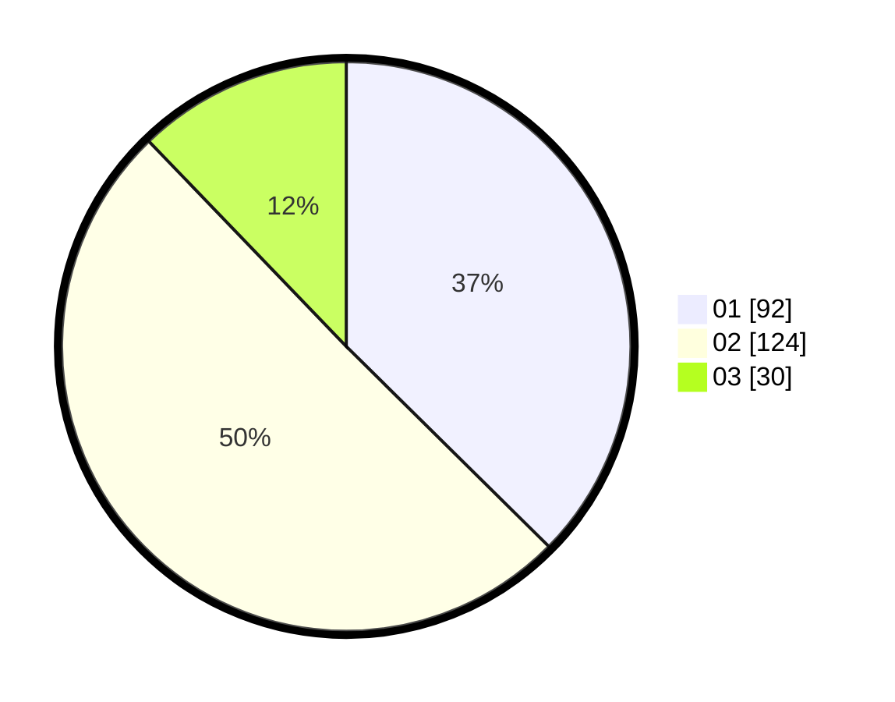

# Hasil

Hasil perolehan suara paslon dapat dilihat pada file paslon-01.txt, paslon-02.txt, dan paslon-03.txt.

Jika tidak ada, artinya data tersebut belum ada pada SIREKAP.

## Perolehan Suara

 * Paslon 01: **92**.
 * Paslon 02: **124**.
 * Paslon 03: **30**.

## Foto C Plano

https://sirekap-obj-formc.kpu.go.id/9364/pemilu/ppwp/31/01/02/10/01/3101021001002-20240215-003050--303a4ecc-9bcd-4d7f-bfeb-79324ab5eec6.jpg

https://sirekap-obj-formc.kpu.go.id/9364/pemilu/ppwp/31/01/02/10/01/3101021001002-20240215-003406--ca146d09-5fb2-4d36-a93c-084140306097.jpg

https://sirekap-obj-formc.kpu.go.id/9364/pemilu/ppwp/31/01/02/10/01/3101021001002-20240215-003851--5a2295b6-35dd-43a9-9b5e-c4a8f4ddf0ea.jpg

## DATA PEMILIH TETAP

Jumlah pemilih dalam DPT: **277**.
 * L: **149**.
 * P: **128**.

## DATA PENGGUNA HAK PILIH

Jumlah pengguna hak pilih dalam DPT: **237**.
 * L: **123**.
 * P: **114**.

Jumlah pengguna hak pilih dalam DPTb: **11**.
 * L: **11**.
 * P: **0**.

Jumlah pengguna hak pilih dalam DPK: **4**.
 * L: **2**.
 * P: **2**.

Jumlah pengguna hak pilih: **252**.
 * L: **136**.
 * P: **116**.

## JUMLAH SUARA SAH DAN TIDAK SAH

JUMLAH SELURUH SUARA SAH: **246**.

JUMLAH SUARA TIDAK SAH: **6**.

JUMLAH SELURUH SUARA SAH DAN SUARA TIDAK SAH: **252**.
