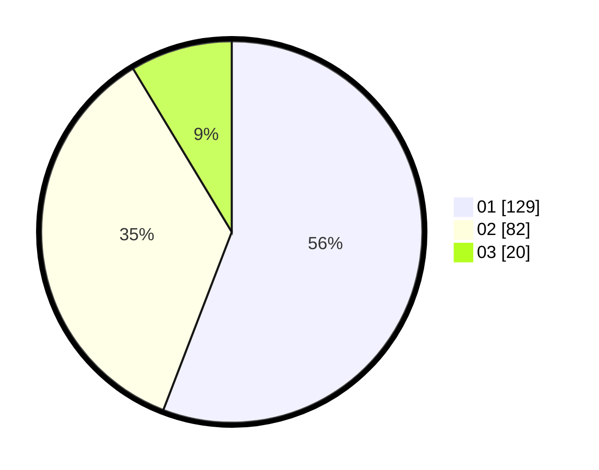

# Hasil

Hasil perolehan suara paslon dapat dilihat pada file paslon-01.txt, paslon-02.txt, dan paslon-03.txt.

Jika tidak ada, artinya data tersebut belum ada pada SIREKAP.

## Perolehan Suara

 * Paslon 01: **129**.
 * Paslon 02: **82**.
 * Paslon 03: **20**.

## Foto C Plano

https://sirekap-obj-formc.kpu.go.id/46a5/pemilu/ppwp/31/01/02/10/01/3101021001005-20240214-190930--a6fc2c5e-79bc-4f09-b51d-7d28d0f9db1a.jpg

https://sirekap-obj-formc.kpu.go.id/46a5/pemilu/ppwp/31/01/02/10/01/3101021001005-20240214-191140--abbf9132-c5d1-45ed-92f6-3b2ca761960c.jpg

https://sirekap-obj-formc.kpu.go.id/46a5/pemilu/ppwp/31/01/02/10/01/3101021001005-20240214-191310--93325939-52e6-40fb-bf20-c36436b3cdb6.jpg

## DATA PEMILIH TETAP

Jumlah pemilih dalam DPT: **273**.
 * L: **134**.
 * P: **139**.

## DATA PENGGUNA HAK PILIH

Jumlah pengguna hak pilih dalam DPT: **228**.
 * L: **107**.
 * P: **121**.

Jumlah pengguna hak pilih dalam DPTb: **4**.
 * L: **3**.
 * P: **1**.

Jumlah pengguna hak pilih dalam DPK: **5**.
 * L: **3**.
 * P: **2**.

Jumlah pengguna hak pilih: **237**.
 * L: **113**.
 * P: **124**.

## JUMLAH SUARA SAH DAN TIDAK SAH

JUMLAH SELURUH SUARA SAH: **231**.

JUMLAH SUARA TIDAK SAH: **6**.

JUMLAH SELURUH SUARA SAH DAN SUARA TIDAK SAH: **237**.
