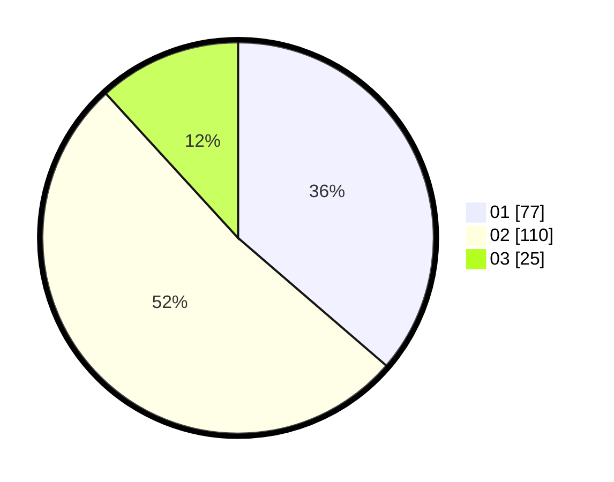

# Hasil

Hasil perolehan suara paslon dapat dilihat pada file paslon-01.txt, paslon-02.txt, dan paslon-03.txt.

Jika tidak ada, artinya data tersebut belum ada pada SIREKAP.

## Perolehan Suara

 * Paslon 01: **77**.
 * Paslon 02: **110**.
 * Paslon 03: **25**.

## Foto C Plano

https://sirekap-obj-formc.kpu.go.id/12f8/pemilu/ppwp/31/01/02/10/02/3101021002001-20240216-122115--b69b9601-9c32-4dcd-9084-68897830f3ff.jpg

https://sirekap-obj-formc.kpu.go.id/12f8/pemilu/ppwp/31/01/02/10/02/3101021002001-20240216-122119--3765eb0a-7068-4ad1-b049-8e994b7577b6.jpg

https://sirekap-obj-formc.kpu.go.id/12f8/pemilu/ppwp/31/01/02/10/02/3101021002001-20240216-103559--62006af9-a5c7-4f2d-9f1f-5679c460354d.jpg

## DATA PEMILIH TETAP

Jumlah pemilih dalam DPT: **0**.
 * L: **0**.
 * P: **0**.

## DATA PENGGUNA HAK PILIH

Jumlah pengguna hak pilih dalam DPT: **213**.
 * L: **102**.
 * P: **111**.

Jumlah pengguna hak pilih dalam DPTb: **1**.
 * L: **1**.
 * P: **0**.

Jumlah pengguna hak pilih dalam DPK: **0**.
 * L: **0**.
 * P: **0**.

Jumlah pengguna hak pilih: **214**.
 * L: **103**.
 * P: **111**.

## JUMLAH SUARA SAH DAN TIDAK SAH

JUMLAH SELURUH SUARA SAH: **212**.

JUMLAH SUARA TIDAK SAH: **2**.

JUMLAH SELURUH SUARA SAH DAN SUARA TIDAK SAH: **214**.
