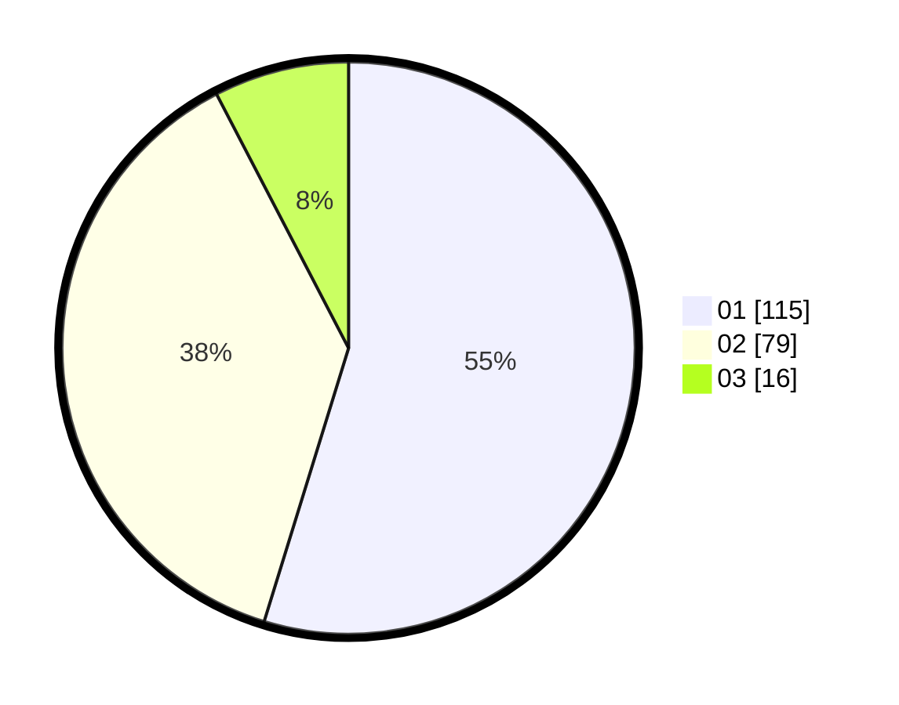

# Hasil

Hasil perolehan suara paslon dapat dilihat pada file paslon-01.txt, paslon-02.txt, dan paslon-03.txt.

Jika tidak ada, artinya data tersebut belum ada pada SIREKAP.

## Perolehan Suara

 * Paslon 01: **115**.
 * Paslon 02: **79**.
 * Paslon 03: **16**.

## Foto C Plano

https://sirekap-obj-formc.kpu.go.id/cfa8/pemilu/ppwp/31/01/02/10/02/3101021002005-20240214-194341--7bbd56c7-ab62-4f16-9b25-9968204072c4.jpg

https://sirekap-obj-formc.kpu.go.id/cfa8/pemilu/ppwp/31/01/02/10/02/3101021002005-20240214-194444--bf96c370-95bd-4738-8f21-2cca5d8dd251.jpg

https://sirekap-obj-formc.kpu.go.id/cfa8/pemilu/ppwp/31/01/02/10/02/3101021002005-20240214-193303--c679aa74-52ea-4609-be57-d3dcfd605008.jpg

## DATA PEMILIH TETAP

Jumlah pemilih dalam DPT: **264**.
 * L: **134**.
 * P: **130**.

## DATA PENGGUNA HAK PILIH

Jumlah pengguna hak pilih dalam DPT: **209**.
 * L: **106**.
 * P: **103**.

Jumlah pengguna hak pilih dalam DPTb: **2**.
 * L: **1**.
 * P: **1**.

Jumlah pengguna hak pilih dalam DPK: **1**.
 * L: **0**.
 * P: **1**.

Jumlah pengguna hak pilih: **212**.
 * L: **107**.
 * P: **105**.

## JUMLAH SUARA SAH DAN TIDAK SAH

JUMLAH SELURUH SUARA SAH: **210**.

JUMLAH SUARA TIDAK SAH: **2**.

JUMLAH SELURUH SUARA SAH DAN SUARA TIDAK SAH: **212**.
