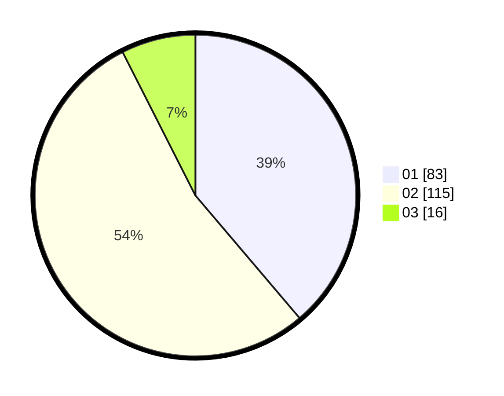

# Hasil

Hasil perolehan suara paslon dapat dilihat pada file paslon-01.txt, paslon-02.txt, dan paslon-03.txt.

Jika tidak ada, artinya data tersebut belum ada pada SIREKAP.

## Perolehan Suara

 * Paslon 01: **83**.
 * Paslon 02: **115**.
 * Paslon 03: **16**.

## Foto C Plano

https://sirekap-obj-formc.kpu.go.id/3497/pemilu/ppwp/31/01/02/10/02/3101021002007-20240214-193930--50ade91a-367d-42f5-ab69-e27dedd3559a.jpg

https://sirekap-obj-formc.kpu.go.id/3497/pemilu/ppwp/31/01/02/10/02/3101021002007-20240214-194414--cb52a48a-15cd-4970-aa67-edc016fdcfbe.jpg

https://sirekap-obj-formc.kpu.go.id/3497/pemilu/ppwp/31/01/02/10/02/3101021002007-20240214-194546--e7ee25de-afd8-4b9e-8c39-715ca2e344da.jpg

## DATA PEMILIH TETAP

Jumlah pemilih dalam DPT: **268**.
 * L: **134**.
 * P: **134**.

## DATA PENGGUNA HAK PILIH

Jumlah pengguna hak pilih dalam DPT: **216**.
 * L: **102**.
 * P: **114**.

Jumlah pengguna hak pilih dalam DPTb: **2**.
 * L: **0**.
 * P: **2**.

Jumlah pengguna hak pilih dalam DPK: **1**.
 * L: **1**.
 * P: **0**.

Jumlah pengguna hak pilih: **219**.
 * L: **103**.
 * P: **116**.

## JUMLAH SUARA SAH DAN TIDAK SAH

JUMLAH SELURUH SUARA SAH: **214**.

JUMLAH SUARA TIDAK SAH: **5**.

JUMLAH SELURUH SUARA SAH DAN SUARA TIDAK SAH: **219**.
