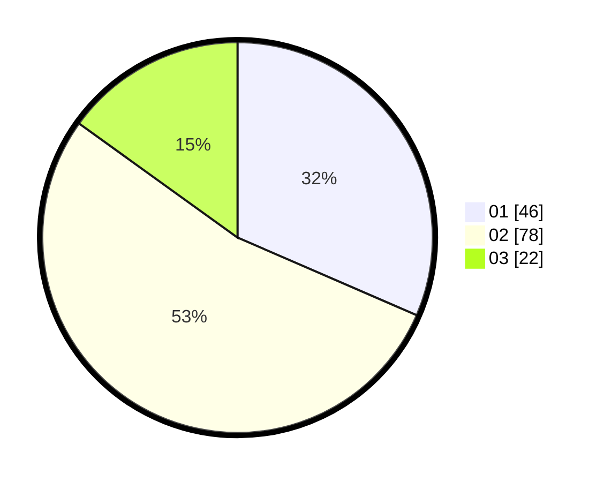

# Hasil

Hasil perolehan suara paslon dapat dilihat pada file paslon-01.txt, paslon-02.txt, dan paslon-03.txt.

Jika tidak ada, artinya data tersebut belum ada pada SIREKAP.

## Perolehan Suara

 * Paslon 01: **46**.
 * Paslon 02: **78**.
 * Paslon 03: **22**.

## Foto C Plano

https://sirekap-obj-formc.kpu.go.id/c676/pemilu/ppwp/31/01/02/10/02/3101021002009-20240214-212023--7168f3c5-1df7-4eee-bda4-d1f993704f76.jpg

https://sirekap-obj-formc.kpu.go.id/c676/pemilu/ppwp/31/01/02/10/02/3101021002009-20240215-030411--45f16c4a-f175-4829-8594-5c02486f4730.jpg

https://sirekap-obj-formc.kpu.go.id/c676/pemilu/ppwp/31/01/02/10/02/3101021002009-20240214-212416--7a4e2343-0662-42f8-b8b5-b920bc3d2d37.jpg

## DATA PEMILIH TETAP

Jumlah pemilih dalam DPT: **168**.
 * L: **82**.
 * P: **86**.

## DATA PENGGUNA HAK PILIH

Jumlah pengguna hak pilih dalam DPT: **142**.
 * L: **69**.
 * P: **73**.

Jumlah pengguna hak pilih dalam DPTb: **7**.
 * L: **4**.
 * P: **3**.

Jumlah pengguna hak pilih dalam DPK: **1**.
 * L: **0**.
 * P: **1**.

Jumlah pengguna hak pilih: **150**.
 * L: **73**.
 * P: **77**.

## JUMLAH SUARA SAH DAN TIDAK SAH

JUMLAH SELURUH SUARA SAH: **146**.

JUMLAH SUARA TIDAK SAH: **4**.

JUMLAH SELURUH SUARA SAH DAN SUARA TIDAK SAH: **150**.
