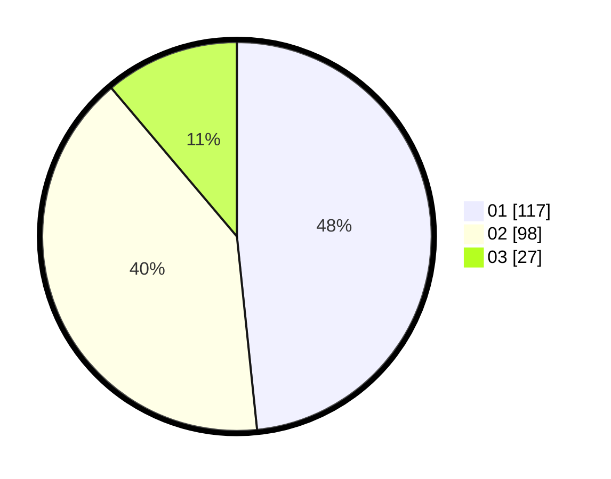

# Hasil

Hasil perolehan suara paslon dapat dilihat pada file paslon-01.txt, paslon-02.txt, dan paslon-03.txt.

Jika tidak ada, artinya data tersebut belum ada pada SIREKAP.

## Perolehan Suara

 * Paslon 01: **117**.
 * Paslon 02: **98**.
 * Paslon 03: **27**.

## Foto C Plano

https://sirekap-obj-formc.kpu.go.id/5bbb/pemilu/ppwp/31/01/02/10/02/3101021002011-20240214-185814--6bdb098e-9407-4d5f-913e-6dac80bb6aaf.jpg

https://sirekap-obj-formc.kpu.go.id/5bbb/pemilu/ppwp/31/01/02/10/02/3101021002011-20240214-190416--5c0ee2cc-c852-4d81-b3f3-14978d0e5ff9.jpg

https://sirekap-obj-formc.kpu.go.id/5bbb/pemilu/ppwp/31/01/02/10/02/3101021002011-20240214-190553--b67d2730-2fc7-4bd3-8d16-c2512c0f2082.jpg

## DATA PEMILIH TETAP

Jumlah pemilih dalam DPT: **275**.
 * L: **137**.
 * P: **138**.

## DATA PENGGUNA HAK PILIH

Jumlah pengguna hak pilih dalam DPT: **244**.
 * L: **113**.
 * P: **131**.

Jumlah pengguna hak pilih dalam DPTb: **1**.
 * L: **0**.
 * P: **1**.

Jumlah pengguna hak pilih dalam DPK: **2**.
 * L: **1**.
 * P: **1**.

Jumlah pengguna hak pilih: **247**.
 * L: **114**.
 * P: **133**.

## JUMLAH SUARA SAH DAN TIDAK SAH

JUMLAH SELURUH SUARA SAH: **242**.

JUMLAH SUARA TIDAK SAH: **5**.

JUMLAH SELURUH SUARA SAH DAN SUARA TIDAK SAH: **247**.
