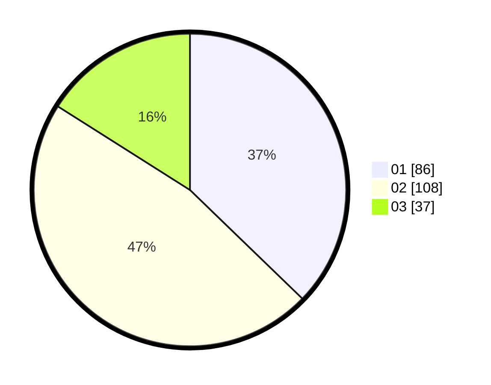

# Hasil

Hasil perolehan suara paslon dapat dilihat pada file paslon-01.txt, paslon-02.txt, dan paslon-03.txt.

Jika tidak ada, artinya data tersebut belum ada pada SIREKAP.

## Perolehan Suara

 * Paslon 01: **86**.
 * Paslon 02: **108**.
 * Paslon 03: **37**.

## Foto C Plano

https://sirekap-obj-formc.kpu.go.id/9159/pemilu/ppwp/31/01/02/10/02/3101021002013-20240214-194406--9fe9b48c-41bc-45f8-b5c1-dd65c891c140.jpg

https://sirekap-obj-formc.kpu.go.id/9159/pemilu/ppwp/31/01/02/10/02/3101021002013-20240214-195309--ddf7bc48-afb1-4f10-a43d-41a376e98f53.jpg

https://sirekap-obj-formc.kpu.go.id/9159/pemilu/ppwp/31/01/02/10/02/3101021002013-20240214-193322--65a8b098-bf4d-4ffa-b111-57c5cdada001.jpg

## DATA PEMILIH TETAP

Jumlah pemilih dalam DPT: **279**.
 * L: **144**.
 * P: **135**.

## DATA PENGGUNA HAK PILIH

Jumlah pengguna hak pilih dalam DPT: **236**.
 * L: **113**.
 * P: **123**.

Jumlah pengguna hak pilih dalam DPTb: **1**.
 * L: **1**.
 * P: **0**.

Jumlah pengguna hak pilih dalam DPK: **0**.
 * L: **0**.
 * P: **0**.

Jumlah pengguna hak pilih: **237**.
 * L: **114**.
 * P: **123**.

## JUMLAH SUARA SAH DAN TIDAK SAH

JUMLAH SELURUH SUARA SAH: **231**.

JUMLAH SUARA TIDAK SAH: **6**.

JUMLAH SELURUH SUARA SAH DAN SUARA TIDAK SAH: **237**.
