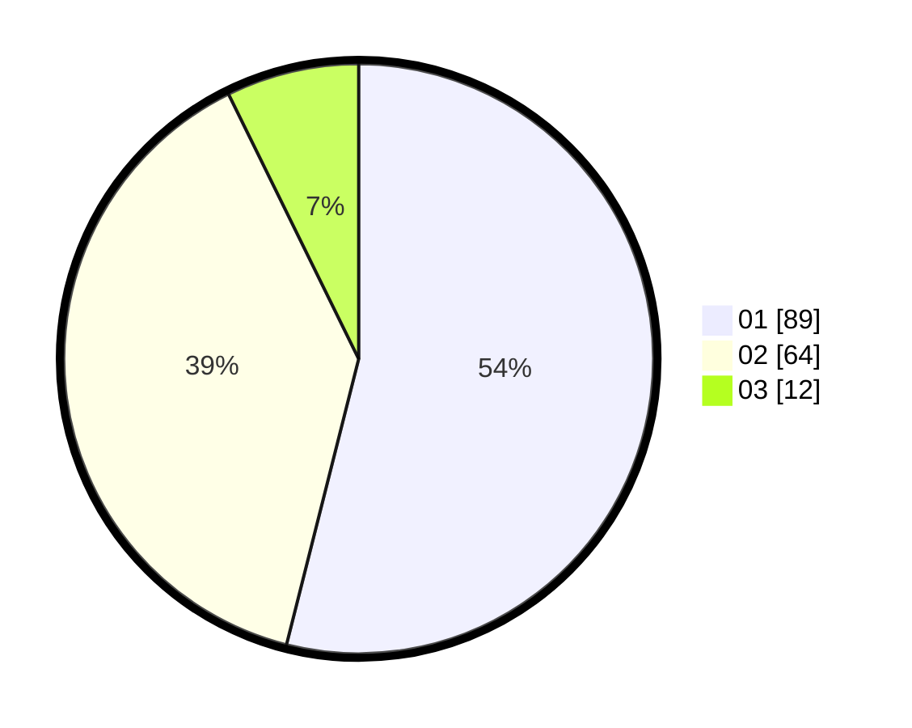

# Hasil

Hasil perolehan suara paslon dapat dilihat pada file paslon-01.txt, paslon-02.txt, dan paslon-03.txt.

Jika tidak ada, artinya data tersebut belum ada pada SIREKAP.

## Perolehan Suara

 * Paslon 01: **89**.
 * Paslon 02: **64**.
 * Paslon 03: **12**.

## Foto C Plano

https://sirekap-obj-formc.kpu.go.id/387b/pemilu/ppwp/31/01/02/10/02/3101021002017-20240214-155322--e75d4915-af99-47e6-8349-3a19a59cc363.jpg

https://sirekap-obj-formc.kpu.go.id/387b/pemilu/ppwp/31/01/02/10/02/3101021002017-20240214-155536--03811b01-58a4-49a3-a414-16d099329f33.jpg

https://sirekap-obj-formc.kpu.go.id/387b/pemilu/ppwp/31/01/02/10/02/3101021002017-20240215-214349--4e49d86c-072c-4917-be55-20a9e46f9277.jpg

## DATA PEMILIH TETAP

Jumlah pemilih dalam DPT: **202**.
 * L: **98**.
 * P: **104**.

## DATA PENGGUNA HAK PILIH

Jumlah pengguna hak pilih dalam DPT: **164**.
 * L: **78**.
 * P: **86**.

Jumlah pengguna hak pilih dalam DPTb: **0**.
 * L: **0**.
 * P: **0**.

Jumlah pengguna hak pilih dalam DPK: **1**.
 * L: **1**.
 * P: **0**.

Jumlah pengguna hak pilih: **165**.
 * L: **79**.
 * P: **86**.

## JUMLAH SUARA SAH DAN TIDAK SAH

JUMLAH SELURUH SUARA SAH: **165**.

JUMLAH SUARA TIDAK SAH: **0**.

JUMLAH SELURUH SUARA SAH DAN SUARA TIDAK SAH: **165**.
