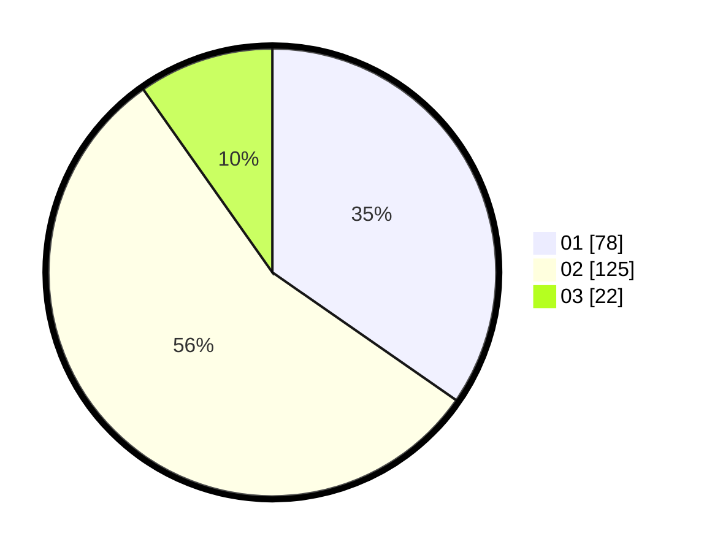

# Hasil

Hasil perolehan suara paslon dapat dilihat pada file paslon-01.txt, paslon-02.txt, dan paslon-03.txt.

Jika tidak ada, artinya data tersebut belum ada pada SIREKAP.

## Perolehan Suara

 * Paslon 01: **78**.
 * Paslon 02: **125**.
 * Paslon 03: **22**.

## Foto C Plano

https://sirekap-obj-formc.kpu.go.id/7f42/pemilu/ppwp/31/01/02/10/03/3101021003002-20240216-142415--7dcb61e7-1fd7-46d6-985c-fc75920bdc77.jpg

https://sirekap-obj-formc.kpu.go.id/7f42/pemilu/ppwp/31/01/02/10/03/3101021003002-20240216-142416--11e60b99-8e0e-4027-84b8-c61cf3893290.jpg

https://sirekap-obj-formc.kpu.go.id/7f42/pemilu/ppwp/31/01/02/10/03/3101021003002-20240216-142416--2059b570-e115-47d1-a246-a2e605d4d5b5.jpg

## DATA PEMILIH TETAP

Jumlah pemilih dalam DPT: **271**.
 * L: **141**.
 * P: **130**.

## DATA PENGGUNA HAK PILIH

Jumlah pengguna hak pilih dalam DPT: **223**.
 * L: **120**.
 * P: **104**.

Jumlah pengguna hak pilih dalam DPTb: **5**.
 * L: **3**.
 * P: **2**.

Jumlah pengguna hak pilih dalam DPK: **1**.
 * L: **0**.
 * P: **1**.

Jumlah pengguna hak pilih: **229**.
 * L: **123**.
 * P: **107**.

## JUMLAH SUARA SAH DAN TIDAK SAH

JUMLAH SELURUH SUARA SAH: **225**.

JUMLAH SUARA TIDAK SAH: **4**.

JUMLAH SELURUH SUARA SAH DAN SUARA TIDAK SAH: **229**.
