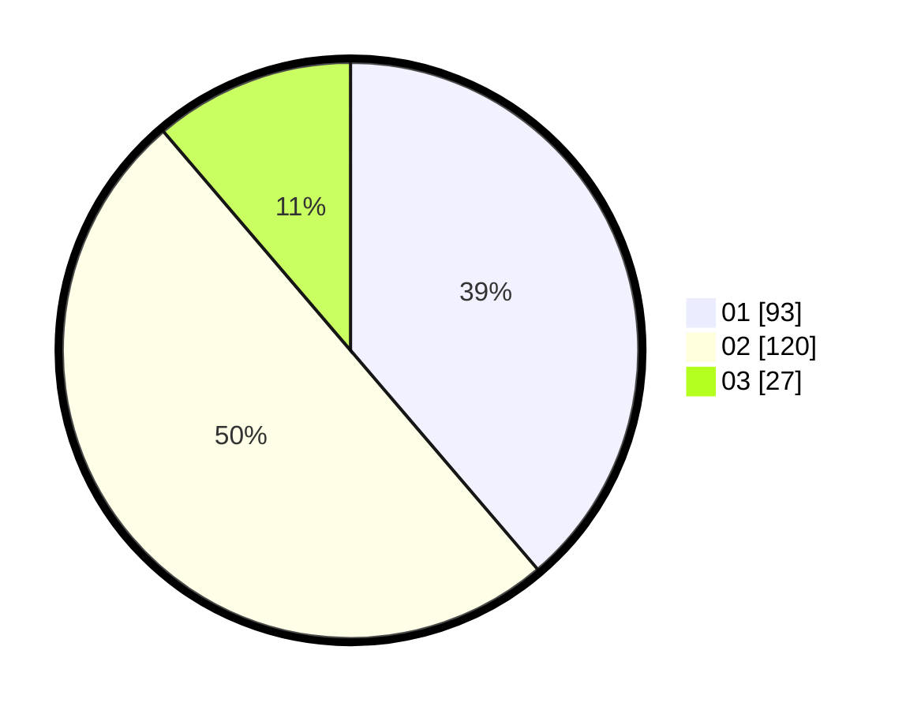

# Hasil

Hasil perolehan suara paslon dapat dilihat pada file paslon-01.txt, paslon-02.txt, dan paslon-03.txt.

Jika tidak ada, artinya data tersebut belum ada pada SIREKAP.

## Perolehan Suara

 * Paslon 01: **93**.
 * Paslon 02: **120**.
 * Paslon 03: **27**.

## Foto C Plano

https://sirekap-obj-formc.kpu.go.id/b588/pemilu/ppwp/31/01/02/10/03/3101021003004-20240215-165041--f32285db-d5c8-4030-88be-179009465c7e.jpg

https://sirekap-obj-formc.kpu.go.id/b588/pemilu/ppwp/31/01/02/10/03/3101021003004-20240215-165412--6e5f30ae-8a4a-4fbd-92fa-6a294606ad8a.jpg

https://sirekap-obj-formc.kpu.go.id/b588/pemilu/ppwp/31/01/02/10/03/3101021003004-20240215-003615--970f2f2d-6f61-4bce-9871-c1bb008a0743.jpg
