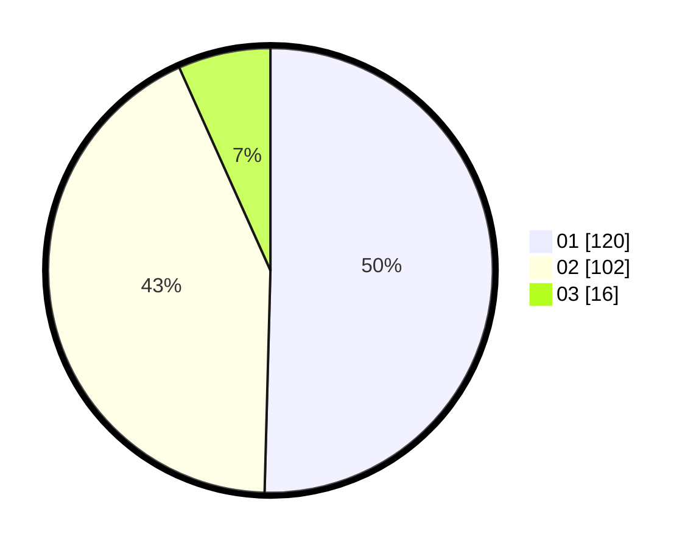

# Hasil

Hasil perolehan suara paslon dapat dilihat pada file paslon-01.txt, paslon-02.txt, dan paslon-03.txt.

Jika tidak ada, artinya data tersebut belum ada pada SIREKAP.

## Perolehan Suara

 * Paslon 01: **120**.
 * Paslon 02: **102**.
 * Paslon 03: **16**.

## Foto C Plano

https://sirekap-obj-formc.kpu.go.id/5ce5/pemilu/ppwp/31/01/02/10/03/3101021003007-20240216-005119--ee6e3339-ed3d-43ed-833b-95bf733886e4.jpg

https://sirekap-obj-formc.kpu.go.id/5ce5/pemilu/ppwp/31/01/02/10/03/3101021003007-20240216-005122--239de6c3-1238-41c7-8f48-e85f833aead2.jpg

https://sirekap-obj-formc.kpu.go.id/5ce5/pemilu/ppwp/31/01/02/10/03/3101021003007-20240216-005119--e370d492-c2ec-4c1b-afea-2575351c2938.jpg

## DATA PEMILIH TETAP

Jumlah pemilih dalam DPT: **278**.
 * L: **132**.
 * P: **146**.

## DATA PENGGUNA HAK PILIH

Jumlah pengguna hak pilih dalam DPT: **231**.
 * L: **109**.
 * P: **122**.

Jumlah pengguna hak pilih dalam DPTb: **18**.
 * L: **17**.
 * P: **1**.

Jumlah pengguna hak pilih dalam DPK: **0**.
 * L: **0**.
 * P: **0**.

Jumlah pengguna hak pilih: **249**.
 * L: **126**.
 * P: **123**.

## JUMLAH SUARA SAH DAN TIDAK SAH

JUMLAH SELURUH SUARA SAH: **238**.

JUMLAH SUARA TIDAK SAH: **11**.

JUMLAH SELURUH SUARA SAH DAN SUARA TIDAK SAH: **249**.
