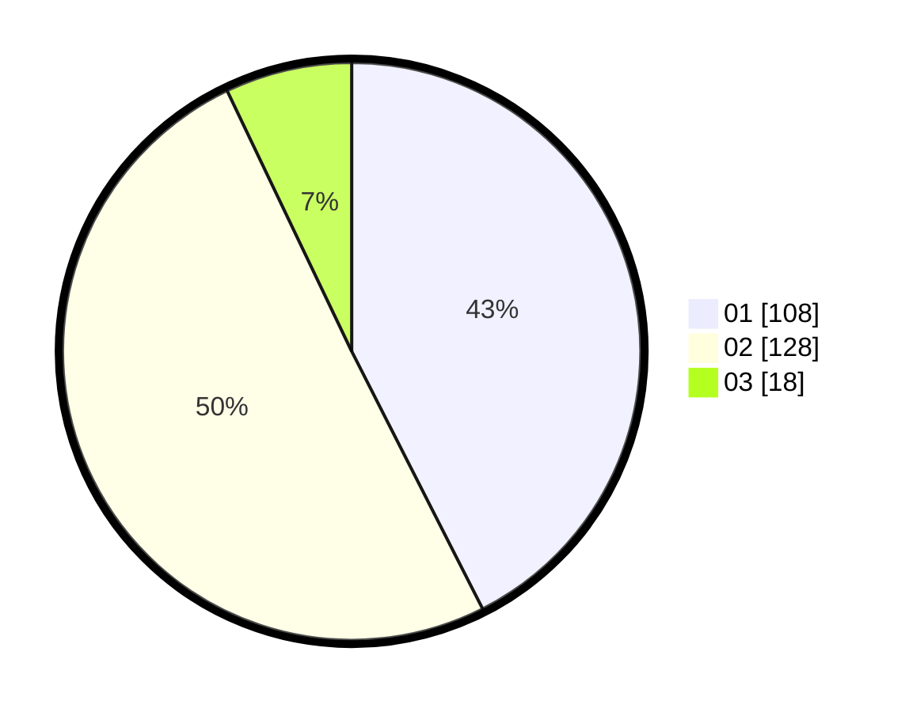

# Hasil

Hasil perolehan suara paslon dapat dilihat pada file paslon-01.txt, paslon-02.txt, dan paslon-03.txt.

Jika tidak ada, artinya data tersebut belum ada pada SIREKAP.

## Perolehan Suara

 * Paslon 01: **108**.
 * Paslon 02: **128**.
 * Paslon 03: **18**.

## Foto C Plano

https://sirekap-obj-formc.kpu.go.id/0bbc/pemilu/ppwp/31/01/02/10/03/3101021003008-20240214-160141--52cde1e6-86d6-4e42-988c-6d673acce010.jpg

https://sirekap-obj-formc.kpu.go.id/0bbc/pemilu/ppwp/31/01/02/10/03/3101021003008-20240214-155823--daac080e-4485-4e5b-a1d3-4aca588edadc.jpg

https://sirekap-obj-formc.kpu.go.id/0bbc/pemilu/ppwp/31/01/02/10/03/3101021003008-20240214-160057--860ce655-9fac-4148-9309-65dbc4d266ad.jpg

## DATA PEMILIH TETAP

Jumlah pemilih dalam DPT: **276**.
 * L: **139**.
 * P: **137**.

## DATA PENGGUNA HAK PILIH

Jumlah pengguna hak pilih dalam DPT: **246**.
 * L: **125**.
 * P: **121**.

Jumlah pengguna hak pilih dalam DPTb: **12**.
 * L: **9**.
 * P: **3**.

Jumlah pengguna hak pilih dalam DPK: **2**.
 * L: **2**.
 * P: **0**.

Jumlah pengguna hak pilih: **260**.
 * L: **136**.
 * P: **124**.

## JUMLAH SUARA SAH DAN TIDAK SAH

JUMLAH SELURUH SUARA SAH: **254**.

JUMLAH SUARA TIDAK SAH: **6**.

JUMLAH SELURUH SUARA SAH DAN SUARA TIDAK SAH: **260**.
