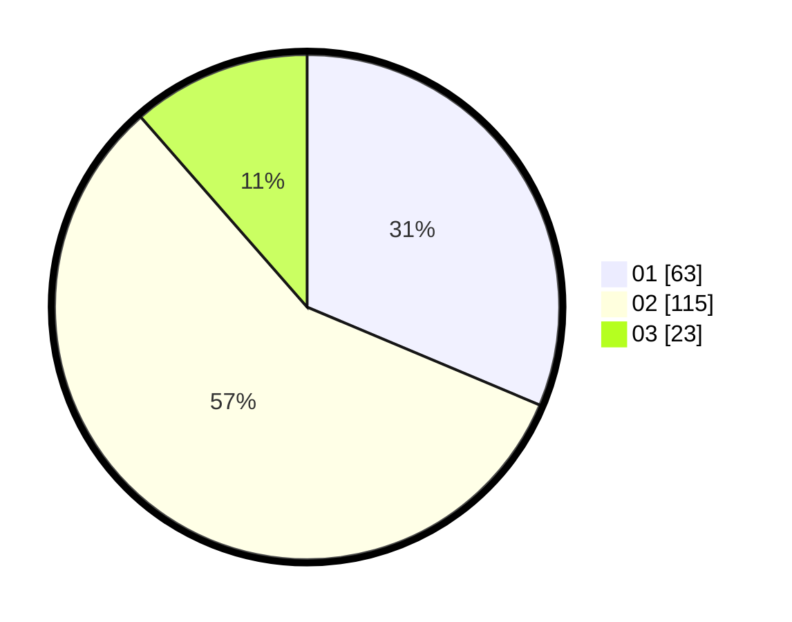

# Hasil

Hasil perolehan suara paslon dapat dilihat pada file paslon-01.txt, paslon-02.txt, dan paslon-03.txt.

Jika tidak ada, artinya data tersebut belum ada pada SIREKAP.

## Perolehan Suara

 * Paslon 01: **63**.
 * Paslon 02: **115**.
 * Paslon 03: **23**.

## Foto C Plano

https://sirekap-obj-formc.kpu.go.id/5af2/pemilu/ppwp/31/01/02/10/03/3101021003010-20240216-120526--a5fd067d-0af1-4f80-89b9-2daaf5d77c87.jpg

https://sirekap-obj-formc.kpu.go.id/5af2/pemilu/ppwp/31/01/02/10/03/3101021003010-20240216-120529--0a5ff6aa-d62a-4ea0-9f90-27e5e63d0dae.jpg

https://sirekap-obj-formc.kpu.go.id/5af2/pemilu/ppwp/31/01/02/10/03/3101021003010-20240216-120527--9a8b1f87-9ed7-4982-a168-365e174cea65.jpg

## DATA PEMILIH TETAP

Jumlah pemilih dalam DPT: **219**.
 * L: **107**.
 * P: **112**.

## DATA PENGGUNA HAK PILIH

Jumlah pengguna hak pilih dalam DPT: **195**.
 * L: **98**.
 * P: **97**.

Jumlah pengguna hak pilih dalam DPTb: **7**.
 * L: **6**.
 * P: **1**.

Jumlah pengguna hak pilih dalam DPK: **3**.
 * L: **1**.
 * P: **2**.

Jumlah pengguna hak pilih: **205**.
 * L: **105**.
 * P: **100**.

## JUMLAH SUARA SAH DAN TIDAK SAH

JUMLAH SELURUH SUARA SAH: **201**.

JUMLAH SUARA TIDAK SAH: **4**.

JUMLAH SELURUH SUARA SAH DAN SUARA TIDAK SAH: **205**.
