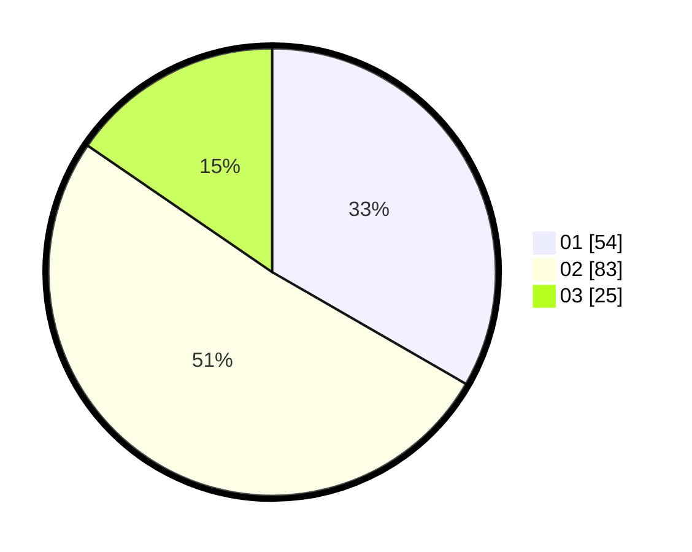

# Hasil

Hasil perolehan suara paslon dapat dilihat pada file paslon-01.txt, paslon-02.txt, dan paslon-03.txt.

Jika tidak ada, artinya data tersebut belum ada pada SIREKAP.

## Perolehan Suara

 * Paslon 01: **54**.
 * Paslon 02: **83**.
 * Paslon 03: **25**.

## Foto C Plano

https://sirekap-obj-formc.kpu.go.id/f5c9/pemilu/ppwp/31/71/01/10/01/3171011001002-20240215-212716--a03ceb06-821e-4605-8020-708162b632ad.jpg

https://sirekap-obj-formc.kpu.go.id/f5c9/pemilu/ppwp/31/71/01/10/01/3171011001002-20240215-212718--af528007-82bb-4c5a-9592-d46f76f50d7b.jpg

https://sirekap-obj-formc.kpu.go.id/f5c9/pemilu/ppwp/31/71/01/10/01/3171011001002-20240215-212717--88d2e3eb-87e9-465a-9777-3218b19904c2.jpg

## DATA PEMILIH TETAP

Jumlah pemilih dalam DPT: **218**.
 * L: **96**.
 * P: **122**.

## DATA PENGGUNA HAK PILIH

Jumlah pengguna hak pilih dalam DPT: **135**.
 * L: **48**.
 * P: **87**.

Jumlah pengguna hak pilih dalam DPTb: **15**.
 * L: **6**.
 * P: **9**.

Jumlah pengguna hak pilih dalam DPK: **14**.
 * L: **5**.
 * P: **9**.

Jumlah pengguna hak pilih: **164**.
 * L: **59**.
 * P: **105**.

## JUMLAH SUARA SAH DAN TIDAK SAH

JUMLAH SELURUH SUARA SAH: **162**.

JUMLAH SUARA TIDAK SAH: **2**.

JUMLAH SELURUH SUARA SAH DAN SUARA TIDAK SAH: **164**.
