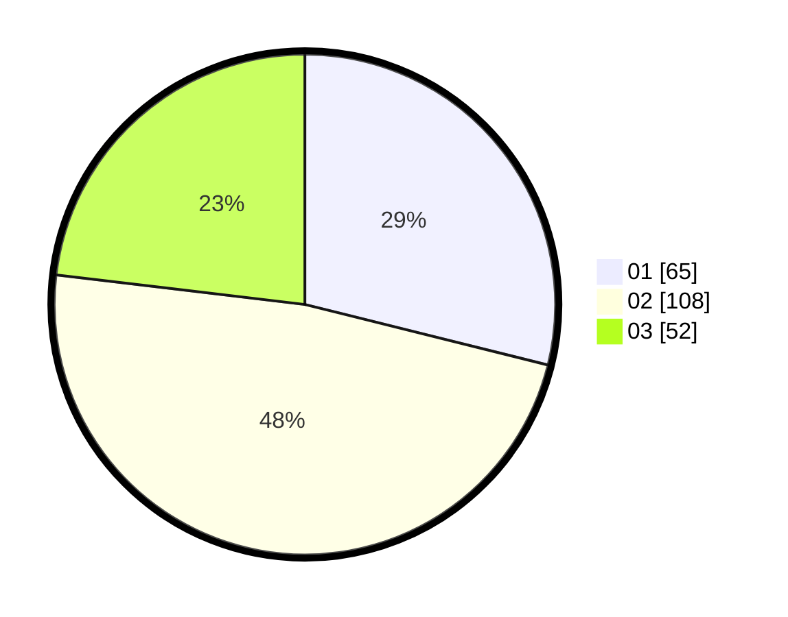

# Hasil

Hasil perolehan suara paslon dapat dilihat pada file paslon-01.txt, paslon-02.txt, dan paslon-03.txt.

Jika tidak ada, artinya data tersebut belum ada pada SIREKAP.

## Perolehan Suara

 * Paslon 01: **65**.
 * Paslon 02: **108**.
 * Paslon 03: **52**.

## Foto C Plano

https://sirekap-obj-formc.kpu.go.id/174d/pemilu/ppwp/31/71/01/10/01/3171011001004-20240216-002741--8f5e30bf-7fe4-48ab-830d-5d092da98868.jpg

https://sirekap-obj-formc.kpu.go.id/174d/pemilu/ppwp/31/71/01/10/01/3171011001004-20240216-002742--f88063e7-1cca-4d4b-b2ad-fe7a49e412d9.jpg

https://sirekap-obj-formc.kpu.go.id/174d/pemilu/ppwp/31/71/01/10/01/3171011001004-20240216-002742--f94b164e-13ce-4627-bd33-8839819c54fb.jpg

## DATA PEMILIH TETAP

Jumlah pemilih dalam DPT: **258**.
 * L: **126**.
 * P: **132**.

## DATA PENGGUNA HAK PILIH

Jumlah pengguna hak pilih dalam DPT: **211**.
 * L: **99**.
 * P: **112**.

Jumlah pengguna hak pilih dalam DPTb: **14**.
 * L: **9**.
 * P: **5**.

Jumlah pengguna hak pilih dalam DPK: **4**.
 * L: **2**.
 * P: **2**.

Jumlah pengguna hak pilih: **229**.
 * L: **110**.
 * P: **119**.

## JUMLAH SUARA SAH DAN TIDAK SAH

JUMLAH SELURUH SUARA SAH: **225**.

JUMLAH SUARA TIDAK SAH: **4**.

JUMLAH SELURUH SUARA SAH DAN SUARA TIDAK SAH: **229**.
