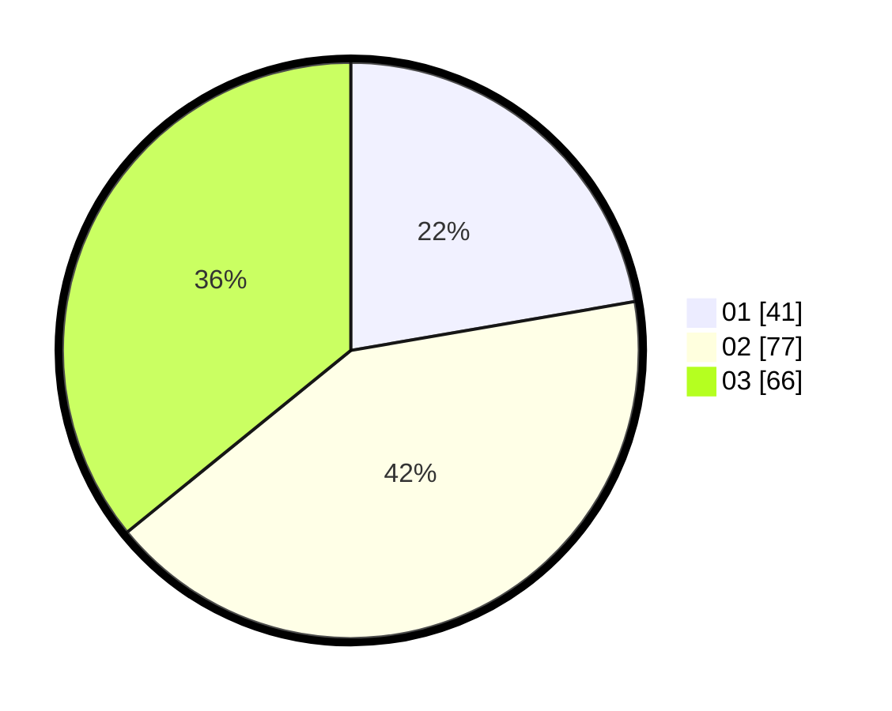

# Hasil

Hasil perolehan suara paslon dapat dilihat pada file paslon-01.txt, paslon-02.txt, dan paslon-03.txt.

Jika tidak ada, artinya data tersebut belum ada pada SIREKAP.

## Perolehan Suara

 * Paslon 01: **41**.
 * Paslon 02: **77**.
 * Paslon 03: **66**.

## Foto C Plano

https://sirekap-obj-formc.kpu.go.id/c717/pemilu/ppwp/31/71/01/10/01/3171011001005-20240215-202655--6a1ac522-a84a-4d57-81bd-c9ff9a7100d9.jpg

https://sirekap-obj-formc.kpu.go.id/c717/pemilu/ppwp/31/71/01/10/01/3171011001005-20240215-000455--97f29b46-f766-464c-a0ed-abbf57ac2c4c.jpg

https://sirekap-obj-formc.kpu.go.id/c717/pemilu/ppwp/31/71/01/10/01/3171011001005-20240215-000540--265f11b7-2174-48ac-b20c-9ee532857031.jpg

## DATA PEMILIH TETAP

Jumlah pemilih dalam DPT: **218**.
 * L: **103**.
 * P: **115**.

## DATA PENGGUNA HAK PILIH

Jumlah pengguna hak pilih dalam DPT: **170**.
 * L: **74**.
 * P: **96**.

Jumlah pengguna hak pilih dalam DPTb: **16**.
 * L: **3**.
 * P: **13**.

Jumlah pengguna hak pilih dalam DPK: **4**.
 * L: **2**.
 * P: **2**.

Jumlah pengguna hak pilih: **190**.
 * L: **79**.
 * P: **111**.

## JUMLAH SUARA SAH DAN TIDAK SAH

JUMLAH SELURUH SUARA SAH: **184**.

JUMLAH SUARA TIDAK SAH: **6**.

JUMLAH SELURUH SUARA SAH DAN SUARA TIDAK SAH: **190**.
