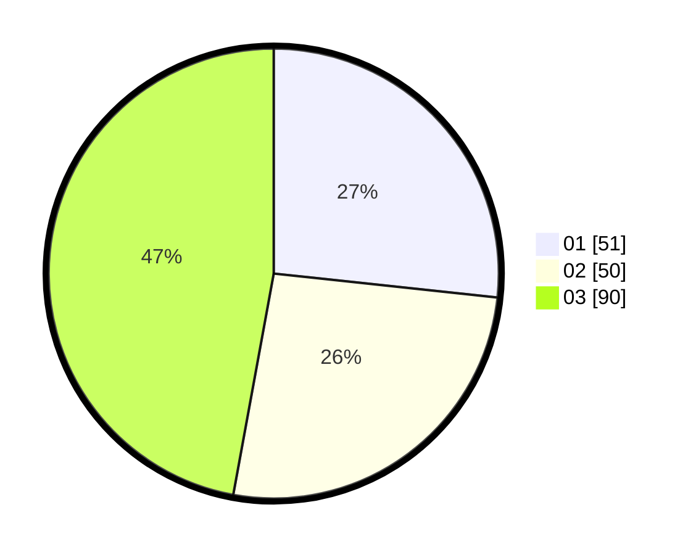

# Hasil

Hasil perolehan suara paslon dapat dilihat pada file paslon-01.txt, paslon-02.txt, dan paslon-03.txt.

Jika tidak ada, artinya data tersebut belum ada pada SIREKAP.

## Perolehan Suara

 * Paslon 01: **51**.
 * Paslon 02: **50**.
 * Paslon 03: **90**.

## Foto C Plano

https://sirekap-obj-formc.kpu.go.id/03d9/pemilu/ppwp/31/71/01/10/02/3171011002002-20240217-185009--a491ef74-9893-4bba-ad99-1ded593680f8.jpg

https://sirekap-obj-formc.kpu.go.id/03d9/pemilu/ppwp/31/71/01/10/02/3171011002002-20240217-185011--514936fc-a47b-40bf-b119-16196ce4360b.jpg

https://sirekap-obj-formc.kpu.go.id/03d9/pemilu/ppwp/31/71/01/10/02/3171011002002-20240217-185010--23844e28-ab05-4e83-8846-d126aee9f301.jpg

## DATA PEMILIH TETAP

Jumlah pemilih dalam DPT: **270**.
 * L: **125**.
 * P: **145**.

## DATA PENGGUNA HAK PILIH

Jumlah pengguna hak pilih dalam DPT: **181**.
 * L: **89**.
 * P: **92**.

Jumlah pengguna hak pilih dalam DPTb: **12**.
 * L: **5**.
 * P: **7**.

Jumlah pengguna hak pilih dalam DPK: **3**.
 * L: **2**.
 * P: **1**.

Jumlah pengguna hak pilih: **196**.
 * L: **96**.
 * P: **100**.

## JUMLAH SUARA SAH DAN TIDAK SAH

JUMLAH SELURUH SUARA SAH: **191**.

JUMLAH SUARA TIDAK SAH: **5**.

JUMLAH SELURUH SUARA SAH DAN SUARA TIDAK SAH: **196**.
