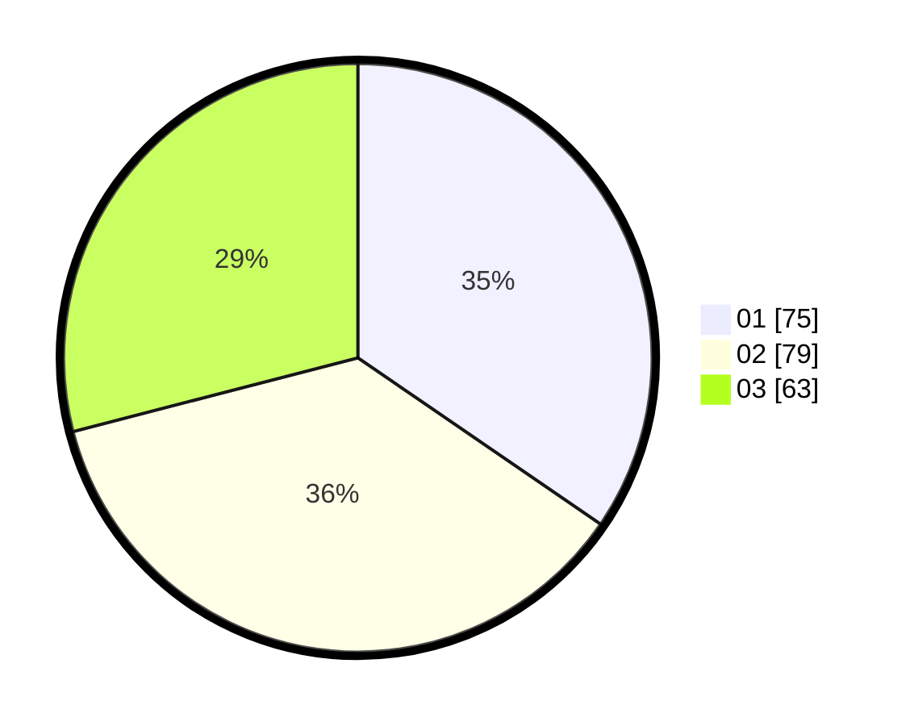

# Hasil

Hasil perolehan suara paslon dapat dilihat pada file paslon-01.txt, paslon-02.txt, dan paslon-03.txt.

Jika tidak ada, artinya data tersebut belum ada pada SIREKAP.

## Perolehan Suara

 * Paslon 01: **75**.
 * Paslon 02: **79**.
 * Paslon 03: **63**.

## Foto C Plano

https://sirekap-obj-formc.kpu.go.id/eb77/pemilu/ppwp/31/71/01/10/02/3171011002005-20240217-182511--6464fb1b-5709-4ded-bfd5-c46ce4a817c4.jpg

https://sirekap-obj-formc.kpu.go.id/eb77/pemilu/ppwp/31/71/01/10/02/3171011002005-20240217-182513--5475240f-acbb-4870-a5d2-883c522a27f8.jpg

https://sirekap-obj-formc.kpu.go.id/eb77/pemilu/ppwp/31/71/01/10/02/3171011002005-20240217-182512--d1cc3509-5d91-405d-8d6c-b6d59314bc33.jpg

## DATA PEMILIH TETAP

Jumlah pemilih dalam DPT: **250**.
 * L: **117**.
 * P: **133**.

## DATA PENGGUNA HAK PILIH

Jumlah pengguna hak pilih dalam DPT: **203**.
 * L: **96**.
 * P: **107**.

Jumlah pengguna hak pilih dalam DPTb: **16**.
 * L: **6**.
 * P: **10**.

Jumlah pengguna hak pilih dalam DPK: **0**.
 * L: **0**.
 * P: **0**.

Jumlah pengguna hak pilih: **219**.
 * L: **102**.
 * P: **117**.

## JUMLAH SUARA SAH DAN TIDAK SAH

JUMLAH SELURUH SUARA SAH: **217**.

JUMLAH SUARA TIDAK SAH: **2**.

JUMLAH SELURUH SUARA SAH DAN SUARA TIDAK SAH: **219**.
