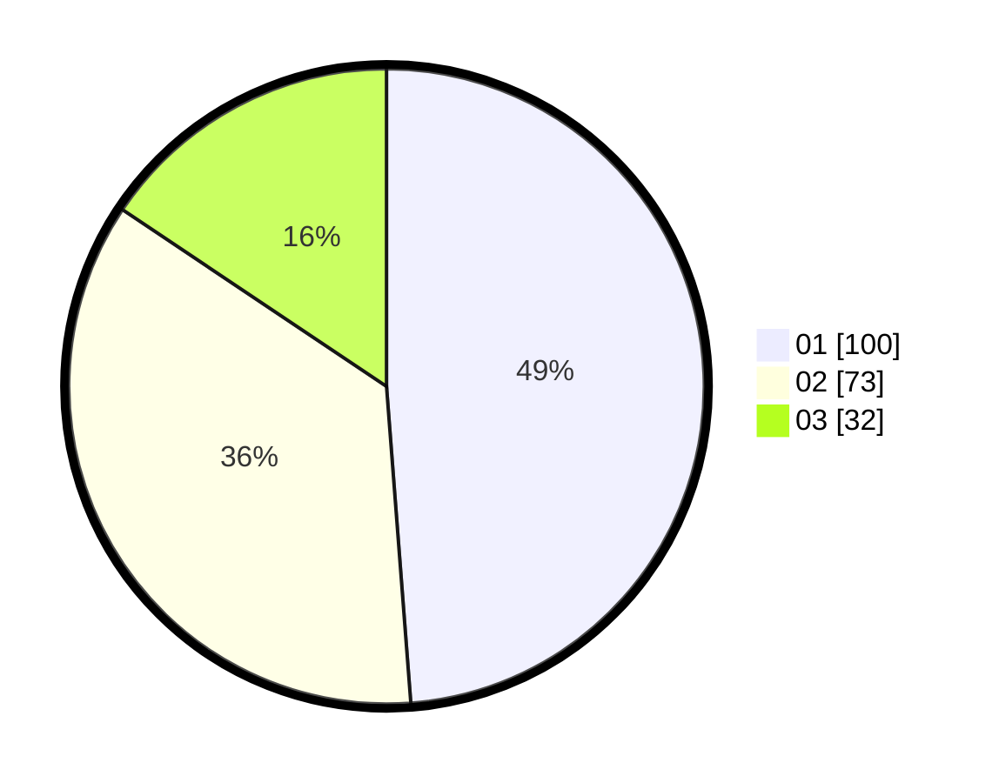

# Hasil

Hasil perolehan suara paslon dapat dilihat pada file paslon-01.txt, paslon-02.txt, dan paslon-03.txt.

Jika tidak ada, artinya data tersebut belum ada pada SIREKAP.

## Perolehan Suara

 * Paslon 01: **100**.
 * Paslon 02: **73**.
 * Paslon 03: **32**.

## Foto C Plano

https://sirekap-obj-formc.kpu.go.id/aa81/pemilu/ppwp/31/71/01/10/02/3171011002007-20240214-202332--a46bc544-7e4b-499e-a012-17f8b9d4946f.jpg

https://sirekap-obj-formc.kpu.go.id/aa81/pemilu/ppwp/31/71/01/10/02/3171011002007-20240214-202429--40f8e520-2614-465f-9eaf-fec4d6931068.jpg

https://sirekap-obj-formc.kpu.go.id/aa81/pemilu/ppwp/31/71/01/10/02/3171011002007-20240214-202715--d868aebc-5bc1-431c-9af0-57914f653f68.jpg
