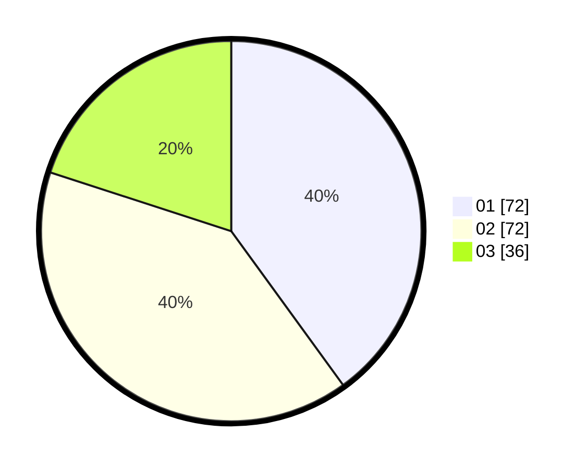

# Hasil

Hasil perolehan suara paslon dapat dilihat pada file paslon-01.txt, paslon-02.txt, dan paslon-03.txt.

Jika tidak ada, artinya data tersebut belum ada pada SIREKAP.

## Perolehan Suara

 * Paslon 01: **72**.
 * Paslon 02: **72**.
 * Paslon 03: **36**.

## Foto C Plano

https://sirekap-obj-formc.kpu.go.id/c4df/pemilu/ppwp/31/71/01/10/02/3171011002009-20240215-052435--73d83bd7-5234-4b8c-98c0-8adea7ff3a2e.jpg

https://sirekap-obj-formc.kpu.go.id/c4df/pemilu/ppwp/31/71/01/10/02/3171011002009-20240215-052457--9ef05a15-715a-47a4-a1d0-a7bfd556ccd4.jpg

https://sirekap-obj-formc.kpu.go.id/c4df/pemilu/ppwp/31/71/01/10/02/3171011002009-20240215-052446--e5d2db5a-31d7-4fdf-bacf-94abf7c7cd73.jpg

## DATA PEMILIH TETAP

Jumlah pemilih dalam DPT: **245**.
 * L: **118**.
 * P: **127**.

## DATA PENGGUNA HAK PILIH

Jumlah pengguna hak pilih dalam DPT: **168**.
 * L: **79**.
 * P: **89**.

Jumlah pengguna hak pilih dalam DPTb: **12**.
 * L: **4**.
 * P: **8**.

Jumlah pengguna hak pilih dalam DPK: **2**.
 * L: **0**.
 * P: **2**.

Jumlah pengguna hak pilih: **182**.
 * L: **83**.
 * P: **99**.

## JUMLAH SUARA SAH DAN TIDAK SAH

JUMLAH SELURUH SUARA SAH: **180**.

JUMLAH SUARA TIDAK SAH: **2**.

JUMLAH SELURUH SUARA SAH DAN SUARA TIDAK SAH: **182**.
