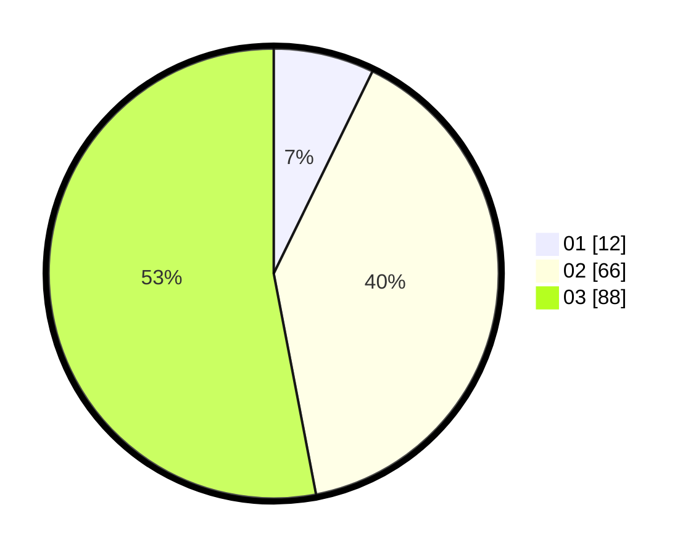

# Hasil

Hasil perolehan suara paslon dapat dilihat pada file paslon-01.txt, paslon-02.txt, dan paslon-03.txt.

Jika tidak ada, artinya data tersebut belum ada pada SIREKAP.

## Perolehan Suara

 * Paslon 01: **12**.
 * Paslon 02: **66**.
 * Paslon 03: **88**.

## Foto C Plano

https://sirekap-obj-formc.kpu.go.id/57b1/pemilu/ppwp/31/71/01/10/02/3171011002011-20240216-174658--696dda0d-da38-4bfc-9d6e-3748a4c9f541.jpg

https://sirekap-obj-formc.kpu.go.id/57b1/pemilu/ppwp/31/71/01/10/02/3171011002011-20240216-174659--fe5497e7-a993-4f3a-b0f3-eee4e7fcc3ec.jpg

https://sirekap-obj-formc.kpu.go.id/57b1/pemilu/ppwp/31/71/01/10/02/3171011002011-20240216-174658--3165b45a-d7b5-4946-94a6-9b0610850ec2.jpg

## DATA PEMILIH TETAP

Jumlah pemilih dalam DPT: **0**.
 * L: **0**.
 * P: **0**.

## DATA PENGGUNA HAK PILIH

Jumlah pengguna hak pilih dalam DPT: **211**.
 * L: **91**.
 * P: **120**.

Jumlah pengguna hak pilih dalam DPTb: **148**.
 * L: **64**.
 * P: **84**.

Jumlah pengguna hak pilih dalam DPK: **0**.
 * L: **0**.
 * P: **0**.

Jumlah pengguna hak pilih: **169**.
 * L: **72**.
 * P: **97**.

## JUMLAH SUARA SAH DAN TIDAK SAH

JUMLAH SELURUH SUARA SAH: **166**.

JUMLAH SUARA TIDAK SAH: **3**.

JUMLAH SELURUH SUARA SAH DAN SUARA TIDAK SAH: **169**.
