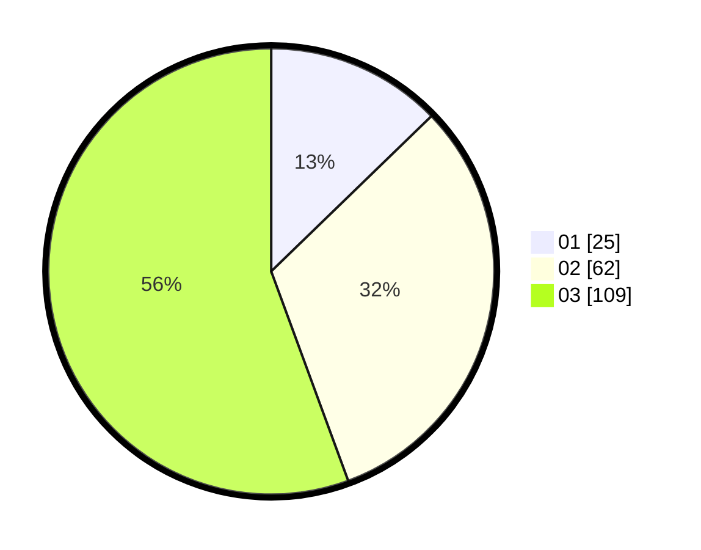

# Hasil

Hasil perolehan suara paslon dapat dilihat pada file paslon-01.txt, paslon-02.txt, dan paslon-03.txt.

Jika tidak ada, artinya data tersebut belum ada pada SIREKAP.

## Perolehan Suara

 * Paslon 01: **25**.
 * Paslon 02: **62**.
 * Paslon 03: **109**.

## Foto C Plano

https://sirekap-obj-formc.kpu.go.id/4593/pemilu/ppwp/31/71/01/10/02/3171011002012-20240214-235820--8543a59c-17c2-4b27-85c4-f1e033cda00a.jpg

https://sirekap-obj-formc.kpu.go.id/4593/pemilu/ppwp/31/71/01/10/02/3171011002012-20240214-201847--0f872894-47d5-4cca-a0d9-c260ade74516.jpg

https://sirekap-obj-formc.kpu.go.id/4593/pemilu/ppwp/31/71/01/10/02/3171011002012-20240214-202105--d22b81bb-4d59-45df-a08d-a7fbdd64f054.jpg

## DATA PEMILIH TETAP

Jumlah pemilih dalam DPT: **257**.
 * L: **119**.
 * P: **138**.

## DATA PENGGUNA HAK PILIH

Jumlah pengguna hak pilih dalam DPT: **177**.
 * L: **82**.
 * P: **95**.

Jumlah pengguna hak pilih dalam DPTb: **18**.
 * L: **7**.
 * P: **11**.

Jumlah pengguna hak pilih dalam DPK: **3**.
 * L: **2**.
 * P: **1**.

Jumlah pengguna hak pilih: **198**.
 * L: **91**.
 * P: **107**.

## JUMLAH SUARA SAH DAN TIDAK SAH

JUMLAH SELURUH SUARA SAH: **196**.

JUMLAH SUARA TIDAK SAH: **2**.

JUMLAH SELURUH SUARA SAH DAN SUARA TIDAK SAH: **198**.
