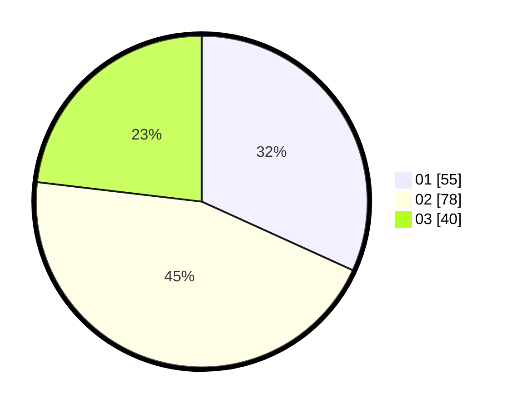

# Hasil

Hasil perolehan suara paslon dapat dilihat pada file paslon-01.txt, paslon-02.txt, dan paslon-03.txt.

Jika tidak ada, artinya data tersebut belum ada pada SIREKAP.

## Perolehan Suara

 * Paslon 01: **55**.
 * Paslon 02: **78**.
 * Paslon 03: **40**.

## Foto C Plano

https://sirekap-obj-formc.kpu.go.id/0c86/pemilu/ppwp/31/71/01/10/02/3171011002018-20240219-103937--51ac5acc-c219-45dd-a459-1c29ca2b55c4.jpg

https://sirekap-obj-formc.kpu.go.id/0c86/pemilu/ppwp/31/71/01/10/02/3171011002018-20240219-140010--d1944c73-355c-4575-a002-f17a7b21950a.jpg

https://sirekap-obj-formc.kpu.go.id/0c86/pemilu/ppwp/31/71/01/10/02/3171011002018-20240219-180116--0410570f-1f9f-4199-a0de-b82cae61e460.jpg
