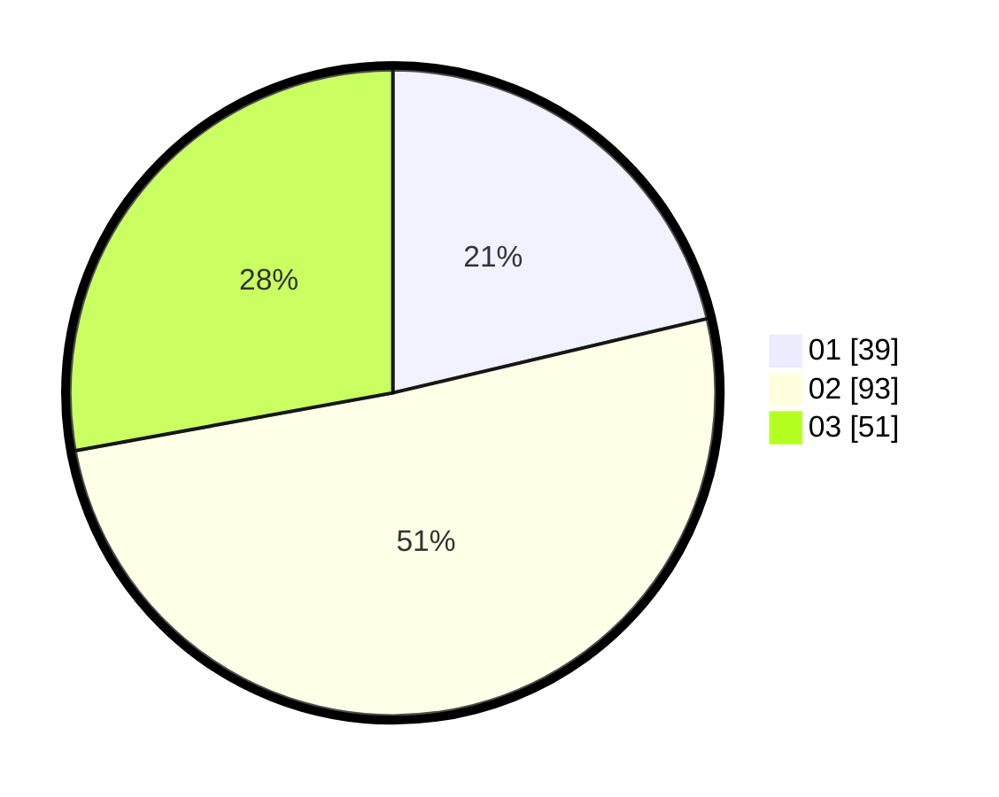

# Hasil

Hasil perolehan suara paslon dapat dilihat pada file paslon-01.txt, paslon-02.txt, dan paslon-03.txt.

Jika tidak ada, artinya data tersebut belum ada pada SIREKAP.

## Perolehan Suara

 * Paslon 01: **39**.
 * Paslon 02: **93**.
 * Paslon 03: **51**.

## Foto C Plano

https://sirekap-obj-formc.kpu.go.id/d919/pemilu/ppwp/31/71/01/10/02/3171011002024-20240216-110928--f47c11fc-566b-4c08-b5a3-bdb491e7341e.jpg

https://sirekap-obj-formc.kpu.go.id/d919/pemilu/ppwp/31/71/01/10/02/3171011002024-20240216-111607--e52c26ea-54f5-4175-9272-f8353982c5d2.jpg

https://sirekap-obj-formc.kpu.go.id/d919/pemilu/ppwp/31/71/01/10/02/3171011002024-20240216-111152--08e32d8b-5921-444b-9497-f6bc742c4244.jpg

## DATA PEMILIH TETAP

Jumlah pemilih dalam DPT: **266**.
 * L: **129**.
 * P: **137**.

## DATA PENGGUNA HAK PILIH

Jumlah pengguna hak pilih dalam DPT: **173**.
 * L: **84**.
 * P: **89**.

Jumlah pengguna hak pilih dalam DPTb: **0**.
 * L: **0**.
 * P: **0**.

Jumlah pengguna hak pilih dalam DPK: **12**.
 * L: **7**.
 * P: **5**.

Jumlah pengguna hak pilih: **185**.
 * L: **91**.
 * P: **94**.

## JUMLAH SUARA SAH DAN TIDAK SAH

JUMLAH SELURUH SUARA SAH: **183**.

JUMLAH SUARA TIDAK SAH: **2**.

JUMLAH SELURUH SUARA SAH DAN SUARA TIDAK SAH: **185**.
