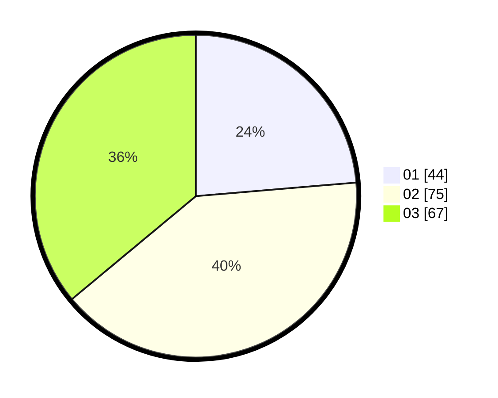

# Hasil

Hasil perolehan suara paslon dapat dilihat pada file paslon-01.txt, paslon-02.txt, dan paslon-03.txt.

Jika tidak ada, artinya data tersebut belum ada pada SIREKAP.

## Perolehan Suara

 * Paslon 01: **44**.
 * Paslon 02: **75**.
 * Paslon 03: **67**.

## Foto C Plano

https://sirekap-obj-formc.kpu.go.id/08f3/pemilu/ppwp/31/71/01/10/02/3171011002026-20240219-075337--426b9b6d-90ce-4a9f-8456-dd3f108fb264.jpg

https://sirekap-obj-formc.kpu.go.id/08f3/pemilu/ppwp/31/71/01/10/02/3171011002026-20240219-085018--0a90c6c8-4b40-45de-832e-0830a393d448.jpg

https://sirekap-obj-formc.kpu.go.id/08f3/pemilu/ppwp/31/71/01/10/02/3171011002026-20240219-091141--80fc7ff0-533e-46a4-b3f9-f8ce74b99b04.jpg

## DATA PEMILIH TETAP

Jumlah pemilih dalam DPT: **263**.
 * L: **128**.
 * P: **135**.

## DATA PENGGUNA HAK PILIH

Jumlah pengguna hak pilih dalam DPT: **182**.
 * L: **88**.
 * P: **94**.

Jumlah pengguna hak pilih dalam DPTb: **5**.
 * L: **2**.
 * P: **3**.

Jumlah pengguna hak pilih dalam DPK: **0**.
 * L: **0**.
 * P: **0**.

Jumlah pengguna hak pilih: **187**.
 * L: **90**.
 * P: **97**.

## JUMLAH SUARA SAH DAN TIDAK SAH

JUMLAH SELURUH SUARA SAH: **186**.

JUMLAH SUARA TIDAK SAH: **1**.

JUMLAH SELURUH SUARA SAH DAN SUARA TIDAK SAH: **187**.
