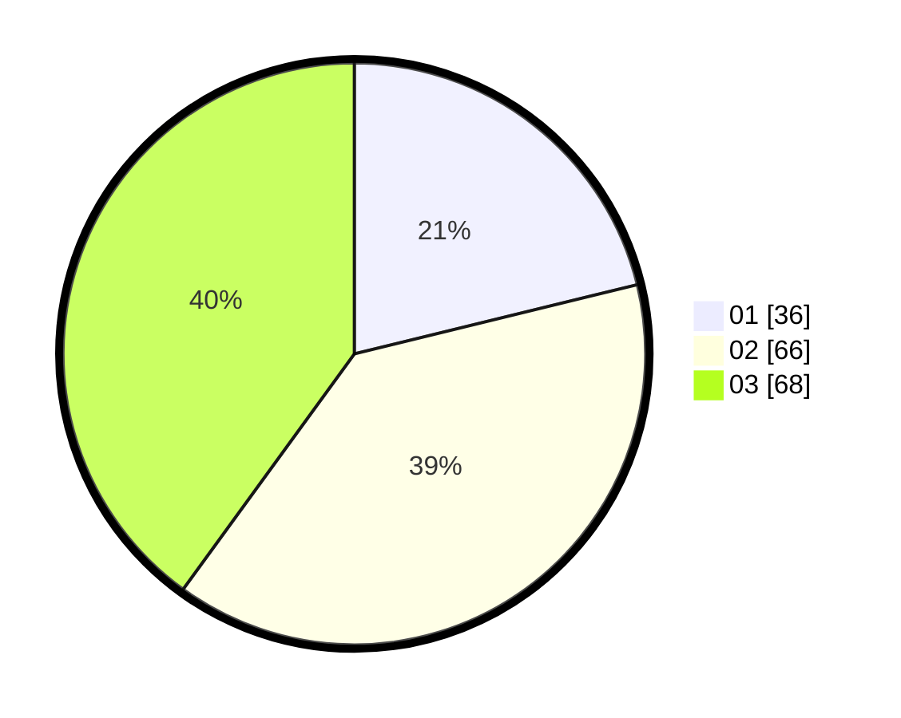

# Hasil

Hasil perolehan suara paslon dapat dilihat pada file paslon-01.txt, paslon-02.txt, dan paslon-03.txt.

Jika tidak ada, artinya data tersebut belum ada pada SIREKAP.

## Perolehan Suara

 * Paslon 01: **36**.
 * Paslon 02: **66**.
 * Paslon 03: **68**.

## Foto C Plano

https://sirekap-obj-formc.kpu.go.id/0bf1/pemilu/ppwp/31/71/01/10/02/3171011002028-20240215-111907--0bf590d8-7a23-4bcf-9ccb-471c1cea26b5.jpg

https://sirekap-obj-formc.kpu.go.id/0bf1/pemilu/ppwp/31/71/01/10/02/3171011002028-20240215-111929--f910f7d5-c4f2-40ed-acf1-4f7f37a5923e.jpg

https://sirekap-obj-formc.kpu.go.id/0bf1/pemilu/ppwp/31/71/01/10/02/3171011002028-20240215-111918--20cde739-b53e-4036-bec4-771fcd3aa98a.jpg

## DATA PEMILIH TETAP

Jumlah pemilih dalam DPT: **266**.
 * L: **131**.
 * P: **135**.

## DATA PENGGUNA HAK PILIH

Jumlah pengguna hak pilih dalam DPT: **167**.
 * L: **80**.
 * P: **87**.

Jumlah pengguna hak pilih dalam DPTb: **2**.
 * L: **0**.
 * P: **2**.

Jumlah pengguna hak pilih dalam DPK: **1**.
 * L: **1**.
 * P: **0**.

Jumlah pengguna hak pilih: **170**.
 * L: **81**.
 * P: **89**.

## JUMLAH SUARA SAH DAN TIDAK SAH

JUMLAH SELURUH SUARA SAH: **170**.

JUMLAH SUARA TIDAK SAH: **0**.

JUMLAH SELURUH SUARA SAH DAN SUARA TIDAK SAH: **170**.
