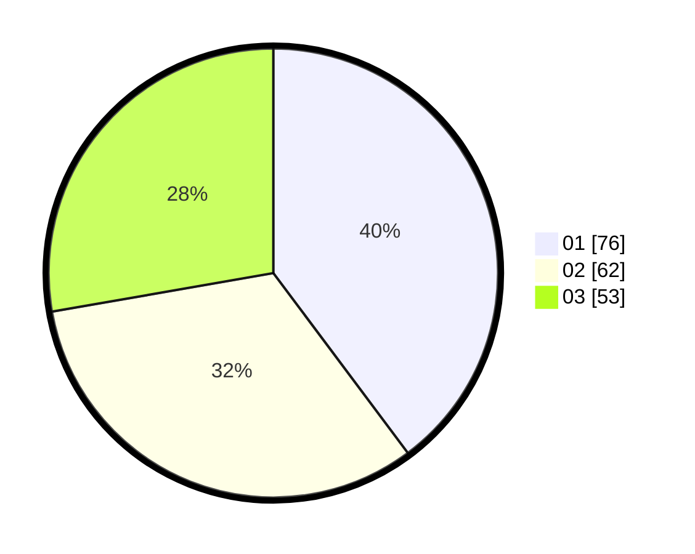

# Hasil

Hasil perolehan suara paslon dapat dilihat pada file paslon-01.txt, paslon-02.txt, dan paslon-03.txt.

Jika tidak ada, artinya data tersebut belum ada pada SIREKAP.

## Perolehan Suara

 * Paslon 01: **76**.
 * Paslon 02: **62**.
 * Paslon 03: **53**.

## Foto C Plano

https://sirekap-obj-formc.kpu.go.id/86d1/pemilu/ppwp/31/71/01/10/02/3171011002029-20240214-184548--e352c3bb-3976-4255-88a3-c8e7a407a382.jpg

https://sirekap-obj-formc.kpu.go.id/86d1/pemilu/ppwp/31/71/01/10/02/3171011002029-20240214-184624--ee7fbd0e-1af6-4238-8402-e926ebf51bef.jpg

https://sirekap-obj-formc.kpu.go.id/86d1/pemilu/ppwp/31/71/01/10/02/3171011002029-20240216-175825--9a7c2fc9-4eed-4676-8d5f-d5566c372b74.jpg

## DATA PEMILIH TETAP

Jumlah pemilih dalam DPT: **271**.
 * L: **125**.
 * P: **146**.

## DATA PENGGUNA HAK PILIH

Jumlah pengguna hak pilih dalam DPT: **190**.
 * L: **89**.
 * P: **101**.

Jumlah pengguna hak pilih dalam DPTb: **4**.
 * L: **1**.
 * P: **3**.

Jumlah pengguna hak pilih dalam DPK: **1**.
 * L: **1**.
 * P: **0**.

Jumlah pengguna hak pilih: **195**.
 * L: **91**.
 * P: **104**.

## JUMLAH SUARA SAH DAN TIDAK SAH

JUMLAH SELURUH SUARA SAH: **191**.

JUMLAH SUARA TIDAK SAH: **4**.

JUMLAH SELURUH SUARA SAH DAN SUARA TIDAK SAH: **195**.
