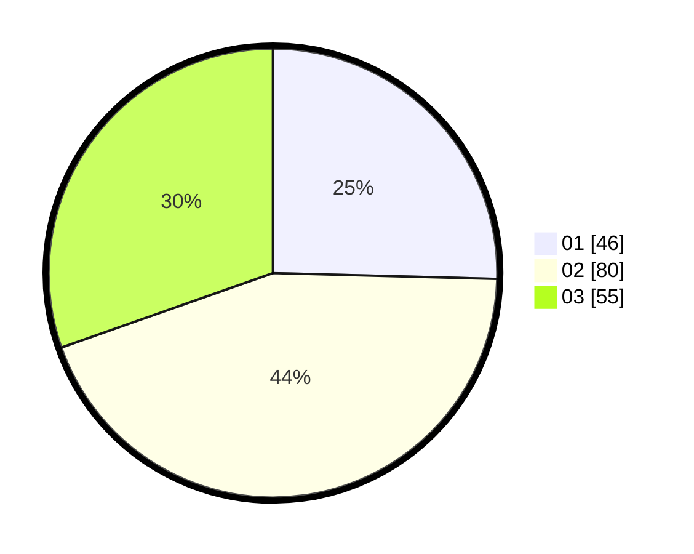

# Hasil

Hasil perolehan suara paslon dapat dilihat pada file paslon-01.txt, paslon-02.txt, dan paslon-03.txt.

Jika tidak ada, artinya data tersebut belum ada pada SIREKAP.

## Perolehan Suara

 * Paslon 01: **46**.
 * Paslon 02: **80**.
 * Paslon 03: **55**.

## Foto C Plano

https://sirekap-obj-formc.kpu.go.id/55ce/pemilu/ppwp/31/71/01/10/02/3171011002034-20240214-215228--545b5589-d4cf-4658-bf8c-a6f9044d3ce6.jpg

https://sirekap-obj-formc.kpu.go.id/55ce/pemilu/ppwp/31/71/01/10/02/3171011002034-20240214-215334--8e5f83f2-4029-4613-a452-05f3e18cf369.jpg

https://sirekap-obj-formc.kpu.go.id/55ce/pemilu/ppwp/31/71/01/10/02/3171011002034-20240214-215502--d81c2854-dd6f-4a7d-b79a-97c08df8b200.jpg

## DATA PEMILIH TETAP

Jumlah pemilih dalam DPT: **257**.
 * L: **118**.
 * P: **139**.

## DATA PENGGUNA HAK PILIH

Jumlah pengguna hak pilih dalam DPT: **177**.
 * L: **84**.
 * P: **93**.

Jumlah pengguna hak pilih dalam DPTb: **3**.
 * L: **1**.
 * P: **2**.

Jumlah pengguna hak pilih dalam DPK: **2**.
 * L: **2**.
 * P: **0**.

Jumlah pengguna hak pilih: **182**.
 * L: **87**.
 * P: **95**.

## JUMLAH SUARA SAH DAN TIDAK SAH

JUMLAH SELURUH SUARA SAH: **181**.

JUMLAH SUARA TIDAK SAH: **1**.

JUMLAH SELURUH SUARA SAH DAN SUARA TIDAK SAH: **182**.
