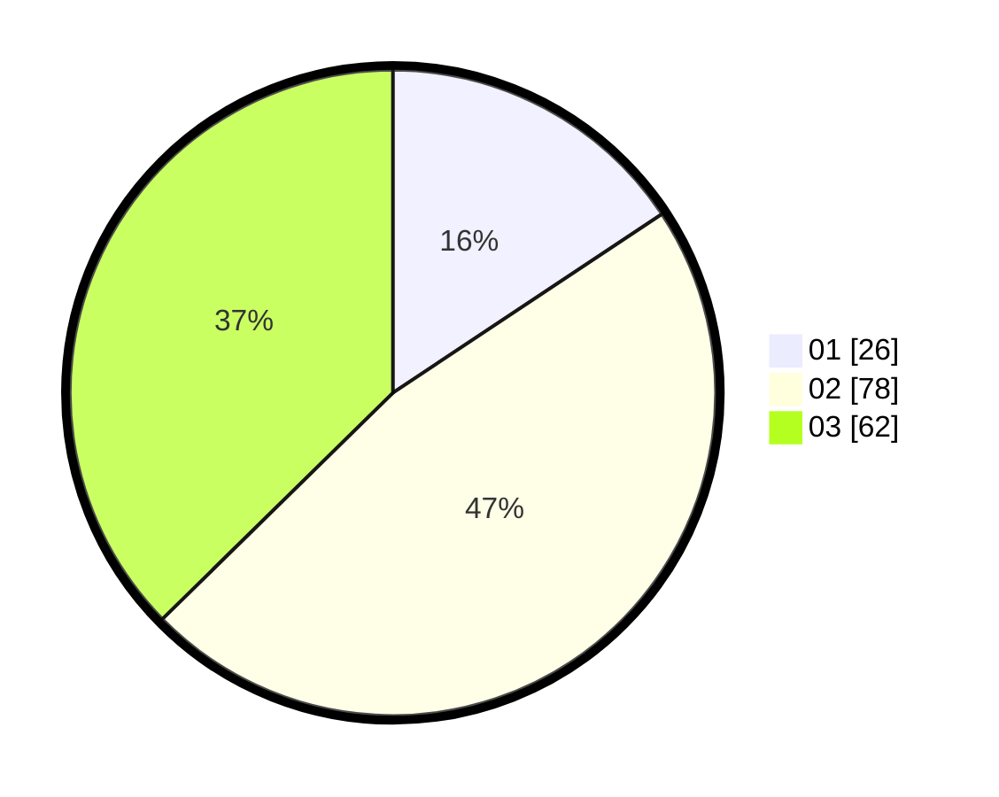

# Hasil

Hasil perolehan suara paslon dapat dilihat pada file paslon-01.txt, paslon-02.txt, dan paslon-03.txt.

Jika tidak ada, artinya data tersebut belum ada pada SIREKAP.

## Perolehan Suara

 * Paslon 01: **26**.
 * Paslon 02: **78**.
 * Paslon 03: **62**.

## Foto C Plano

https://sirekap-obj-formc.kpu.go.id/a1e1/pemilu/ppwp/31/71/01/10/02/3171011002040-20240216-041358--14fc19c1-942c-4582-93f1-9c6679354ecf.jpg

https://sirekap-obj-formc.kpu.go.id/a1e1/pemilu/ppwp/31/71/01/10/02/3171011002040-20240216-041402--5029ce08-a1d7-41df-a23a-5cc593c619e6.jpg

https://sirekap-obj-formc.kpu.go.id/a1e1/pemilu/ppwp/31/71/01/10/02/3171011002040-20240216-041359--2c6336bf-1d4a-463c-aac0-960429a60310.jpg

## DATA PEMILIH TETAP

Jumlah pemilih dalam DPT: **212**.
 * L: **91**.
 * P: **121**.

## DATA PENGGUNA HAK PILIH

Jumlah pengguna hak pilih dalam DPT: **156**.
 * L: **71**.
 * P: **85**.

Jumlah pengguna hak pilih dalam DPTb: **10**.
 * L: **5**.
 * P: **5**.

Jumlah pengguna hak pilih dalam DPK: **3**.
 * L: **1**.
 * P: **2**.

Jumlah pengguna hak pilih: **169**.
 * L: **77**.
 * P: **92**.

## JUMLAH SUARA SAH DAN TIDAK SAH

JUMLAH SELURUH SUARA SAH: **166**.

JUMLAH SUARA TIDAK SAH: **3**.

JUMLAH SELURUH SUARA SAH DAN SUARA TIDAK SAH: **169**.
