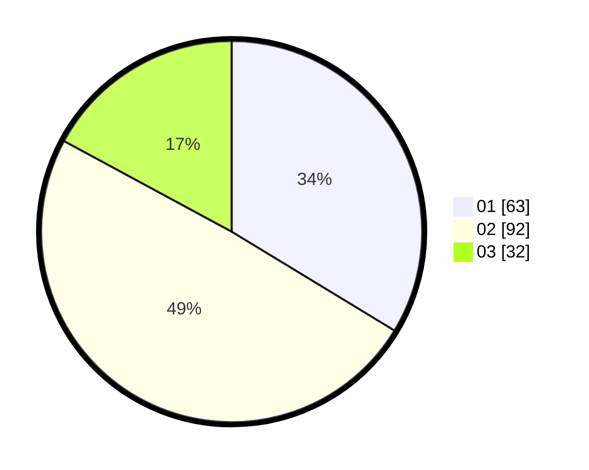

# Hasil

Hasil perolehan suara paslon dapat dilihat pada file paslon-01.txt, paslon-02.txt, dan paslon-03.txt.

Jika tidak ada, artinya data tersebut belum ada pada SIREKAP.

## Perolehan Suara

 * Paslon 01: **63**.
 * Paslon 02: **92**.
 * Paslon 03: **32**.

## Foto C Plano

https://sirekap-obj-formc.kpu.go.id/adca/pemilu/ppwp/31/71/01/10/02/3171011002041-20240216-140144--a42c7e94-4542-4f57-a622-a4ffcf34b798.jpg

https://sirekap-obj-formc.kpu.go.id/adca/pemilu/ppwp/31/71/01/10/02/3171011002041-20240216-140658--1ef12537-d4ed-4f7d-be02-68dae5966140.jpg

https://sirekap-obj-formc.kpu.go.id/adca/pemilu/ppwp/31/71/01/10/02/3171011002041-20240216-140959--3197cb5c-7bf4-4831-aca0-8f9086b4f35d.jpg

## DATA PEMILIH TETAP

Jumlah pemilih dalam DPT: **238**.
 * L: **103**.
 * P: **135**.

## DATA PENGGUNA HAK PILIH

Jumlah pengguna hak pilih dalam DPT: **181**.
 * L: **75**.
 * P: **106**.

Jumlah pengguna hak pilih dalam DPTb: **6**.
 * L: **4**.
 * P: **2**.

Jumlah pengguna hak pilih dalam DPK: **1**.
 * L: **1**.
 * P: **0**.

Jumlah pengguna hak pilih: **188**.
 * L: **80**.
 * P: **108**.

## JUMLAH SUARA SAH DAN TIDAK SAH

JUMLAH SELURUH SUARA SAH: **187**.

JUMLAH SUARA TIDAK SAH: **1**.

JUMLAH SELURUH SUARA SAH DAN SUARA TIDAK SAH: **188**.
