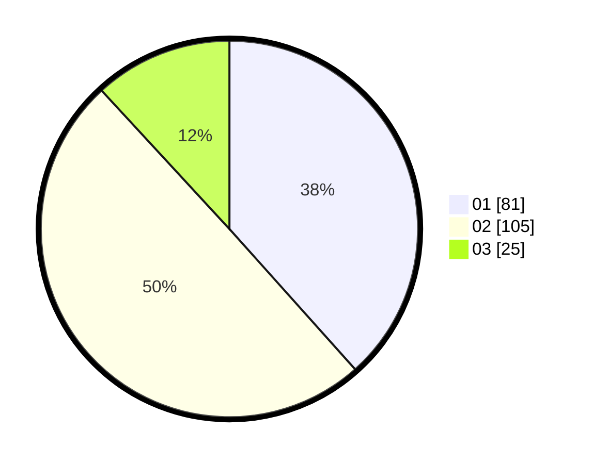

# Hasil

Hasil perolehan suara paslon dapat dilihat pada file paslon-01.txt, paslon-02.txt, dan paslon-03.txt.

Jika tidak ada, artinya data tersebut belum ada pada SIREKAP.

## Perolehan Suara

 * Paslon 01: **81**.
 * Paslon 02: **105**.
 * Paslon 03: **25**.

## Foto C Plano

https://sirekap-obj-formc.kpu.go.id/5b31/pemilu/ppwp/31/71/01/10/02/3171011002043-20240218-171416--117bfee1-0218-435c-9390-ee8bb33f9ecb.jpg

https://sirekap-obj-formc.kpu.go.id/5b31/pemilu/ppwp/31/71/01/10/02/3171011002043-20240218-171418--20c27b0b-4315-423c-9efd-8670ea04423d.jpg

https://sirekap-obj-formc.kpu.go.id/5b31/pemilu/ppwp/31/71/01/10/02/3171011002043-20240218-171417--f1c7af17-e7b4-40e8-b621-bd6dea874b92.jpg

## DATA PEMILIH TETAP

Jumlah pemilih dalam DPT: **293**.
 * L: **149**.
 * P: **144**.

## DATA PENGGUNA HAK PILIH

Jumlah pengguna hak pilih dalam DPT: **217**.
 * L: **102**.
 * P: **115**.

Jumlah pengguna hak pilih dalam DPTb: **0**.
 * L: **0**.
 * P: **0**.

Jumlah pengguna hak pilih dalam DPK: **2**.
 * L: **2**.
 * P: **0**.

Jumlah pengguna hak pilih: **219**.
 * L: **104**.
 * P: **115**.

## JUMLAH SUARA SAH DAN TIDAK SAH

JUMLAH SELURUH SUARA SAH: **211**.

JUMLAH SUARA TIDAK SAH: **8**.

JUMLAH SELURUH SUARA SAH DAN SUARA TIDAK SAH: **219**.
