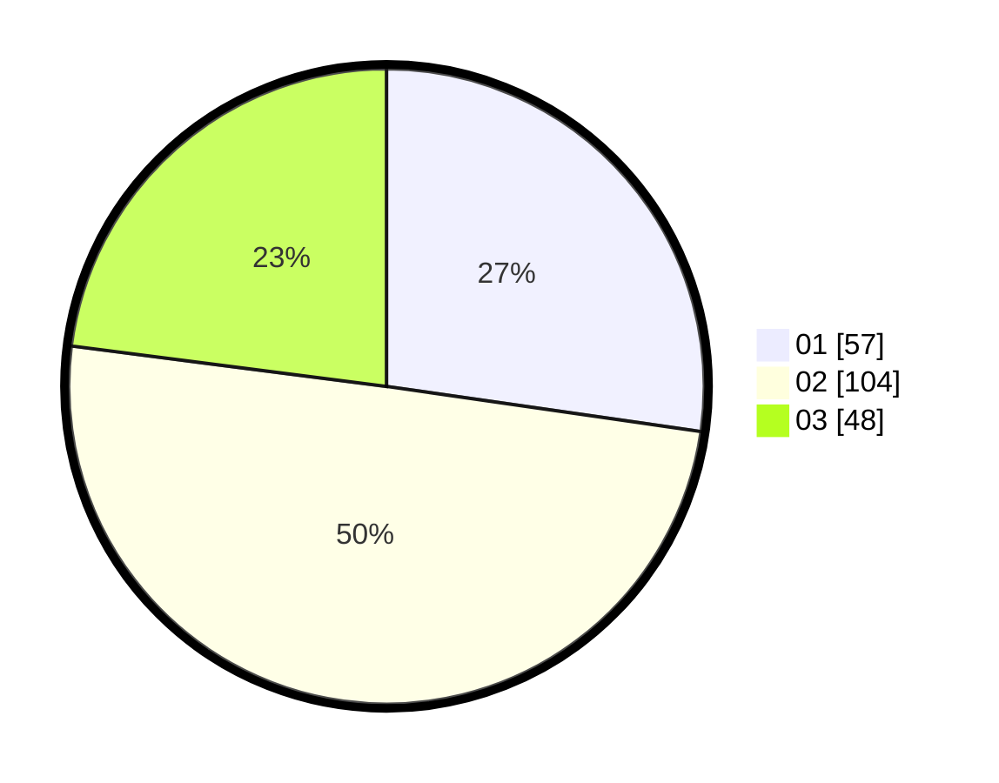

# Hasil

Hasil perolehan suara paslon dapat dilihat pada file paslon-01.txt, paslon-02.txt, dan paslon-03.txt.

Jika tidak ada, artinya data tersebut belum ada pada SIREKAP.

## Perolehan Suara

 * Paslon 01: **57**.
 * Paslon 02: **104**.
 * Paslon 03: **48**.

## Foto C Plano

https://sirekap-obj-formc.kpu.go.id/9d88/pemilu/ppwp/31/71/01/10/02/3171011002044-20240217-174909--669d7057-29f0-4e5f-8073-ce7815925f52.jpg

https://sirekap-obj-formc.kpu.go.id/9d88/pemilu/ppwp/31/71/01/10/02/3171011002044-20240217-174910--5da78542-a3ff-4b3c-b33b-fafb5085ccb4.jpg

https://sirekap-obj-formc.kpu.go.id/9d88/pemilu/ppwp/31/71/01/10/02/3171011002044-20240217-174910--2ebf0483-02ac-406e-a8ac-c1bbdcaba031.jpg

## DATA PEMILIH TETAP

Jumlah pemilih dalam DPT: **286**.
 * L: **151**.
 * P: **135**.

## DATA PENGGUNA HAK PILIH

Jumlah pengguna hak pilih dalam DPT: **214**.
 * L: **105**.
 * P: **109**.

Jumlah pengguna hak pilih dalam DPTb: **0**.
 * L: **0**.
 * P: **0**.

Jumlah pengguna hak pilih dalam DPK: **1**.
 * L: **1**.
 * P: **0**.

Jumlah pengguna hak pilih: **215**.
 * L: **106**.
 * P: **109**.

## JUMLAH SUARA SAH DAN TIDAK SAH

JUMLAH SELURUH SUARA SAH: **209**.

JUMLAH SUARA TIDAK SAH: **6**.

JUMLAH SELURUH SUARA SAH DAN SUARA TIDAK SAH: **215**.
